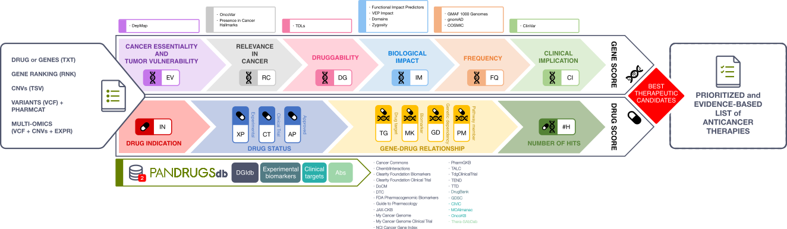
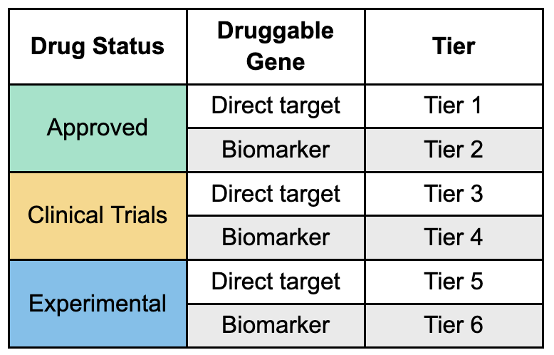

## PanDrugs FAQs

- [What is PanDrugs?](#!/faqs#what-is-pandrugs)
- [What does the DScore represent?](#!/faqs#dscore)
- [What does the GScore represent?](#!/faqs#gscore)
- [What are the Best Therapeutic Candidates (BTCs)?](#!/faqs#best-therapeutic-candidates)
- [Which are PanDrugsdb sources?](#!/faqs#pandrugsdb-sources)
- [What inputs does PanDrugs accept?](#!/faqs#pandrugs-inputs)
- [What information does the report contain?](#!/faqs#report-info)
- [Does PanDrugs include drug-gene associations involving mitochondrial genes?](#!/faqs#mitochondrial)
- [Can I input a VCF containing only germline variants?](#!/faqs#only-germline)
- [How do I cite PanDrugs?](#!/faqs#citation)
- [Which license does PanDrugs use?](#!/faqs#license)
- [Can I use PanDrugs for medical advice?](#!/faqs#medical-advice)
- [Can I use PanDrugs with non-cancer data?](#!/faqs#non-cancer-data)
- [Can I use PanDrugs for commercial purposes?](#!/faqs#commercial-use)
- [What is PanDrugs data policy?](#!/faqs#data-policy)
- [Do I need to register to use PanDrugs?](#!/faqs#registration)
- [Is it possible to run PanDrugs on my own server?](#!/faqs#docker)

### What is PanDrugs?
PanDrugs is a bioinformatics platform to prioritize anticancer drug treatments using individual multi-omics data. **This prioritization is performed through the intersection of two scores: the DScore and the GScore**.

### What does the DScore represent?
The **DScore** measures the **suitability of the treatment** for a particular patient. It is computed according to the drug indication and approval status, the number of genes associated with a drug, the nature and reliability of these associations and the type of drug response. The DScore **ranges from -1 to 1**, with the negative values corresponding to resistance and the positive values corresponding to sensitivity.

You can find more details regarding the DScore computation [here](#!/help#dscore-calculation).

### What does the GScore represent?
The **GScore** measures the **biological relevance of a gene in the tumoral process and its druggability**. It is estimated according to gene essentiality, tumour vulnerability, the relevance of the gene in cancer, its druggability level, the biological impact of mutations, the frequency of gene alterations and their clinical implications. The GScore **ranges from 0 to 1**, with higher values corresponding to more relevant and actionable targets.

You can find more details regarding the GScore computation [here](#!/help#gscore-calculation).

### What are the Best Therapeutic Candidates (BTCs)?
PanDrugs provides a prioritized list of candidate drugs considering the DScore and GScore values. **Those therapies supported by DScores and GScores closer to 1 will have higher evidence of their effectiveness in cancer treatment and will be considered as Best Therapeutic Candidates (BTCs)**. 

The thresholds for labelling a drug as BTC are DScore > 0.7 and GScore > 0.6.

### Which are PanDrugsdb sources?
You can check all sources used to build PanDrugsdb on [Sources](#!/sources) page.

### What inputs does PanDrugs accept?
For more information, please check the [Help](#!/help#query-options) page.

### What information does the report contain? 
For more information, please check the [Help](#!/help#report) page.

### Does PanDrugs include drug-gene associations involving mitochondrial genes?
Yes, the current version of PanDrugsdb includes 73 drug-gene associations between 13 mitochondrial genes and 37 drugs.

### Can I input a VCF containing only germline variants?
Currently, **PanDrugs requires that your VCF contains somatic variants** in order to generate a drug ranking. Germline variants are used to annotate ranked drugs according to the recommendations provided by the [Clinical Pharmacogenetics Implementation Consortium (CPIC)](https://cpicpgx.org), which are retrieved via [PharmCAT](https://pharmcat.org).

### How do I cite PanDrugs?
When citing our application, please refer to **PanDrugs publication:**

- Jiménez-Santos, M. J. *et al.* (2023). [PanDrugs2: prioritizing cancer therapies using integrated individual multi-omics data.](https://doi.org/10.1093/nar/gkad412) *Nucleic Acids Research. 51*(Web Server Issue W1), pp. W411-W418. 

- Piñeiro-Yáñez, E. *et al.* (2018). [PanDrugs: a novel method to prioritize anticancer drug treatments according to individual genomic data.](https://doi.org/10.1186/s13073-018-0546-1) *Genome medicine, 10*(1), 41.

A list of PanDrugs-related publications is available [here](#!/citation#related-work).

### Which license does PanDrugs use?
GPLv3.

### Can I use PanDrugs for medical advice?
PanDrugs is exclusively intended for research purposes and academic use. **It should not be used for medical or professional advice**.

### Can I use PanDrugs with non-cancer data?
PanDrugs has been designed to prioritize drugs using cancer genomics data. Nevertheless, genomics data from patients suffering from other conditions (e.g. Alzheimer's Disease) could be used for exploratory purposes. In such cases, please keep in mind that **the DScore and the GScore are biased towards cancer-related drugs and genes**. Thus, we recommend you **tier the results by the drug status and the association with the druggable gene**:

### Can I use PanDrugs for commercial purposes?
PanDrugs is exclusively intended for research purposes and academic use. **In case you are interested in a collaboration, please contact the principal investigator [Fátima Al-Shahrour](mailto:falshahrour@cnio.es)**.

### What is PanDrugs data policy?
To prevent unauthorized access or disclosure, PanDrugs uses several technical measures to safeguard your data, following current technological and industry standards. In particular, all connections to and from our website are encrypted using Secure Socket Layer (SSL). Passwords are hashed in our database.

Input VCFs are deleted right after execution. However, data analysed with PanDrugs are stored on our private servers. These data include annotations for somatic variants and PharmCAT's report for germline ones. Removing an analysis implies that it will be completely and permanently removed from PanDrugs servers. **Files are not shared with third parties**.

We ensure that data and results are kept for at least 1 week for guest requests and at least 6 months for authenticated users.

### Do I need to register to use PanDrugs?
No, you can make queries on PanDrugs as a guest user.

### Is it possible to run PanDrugs on my own server?
Yes, you can build a docker image to run PanDrugs on your own server. Please, visit PanDrugs docker [here](http://github.com/sing-group/pandrugs-docker).