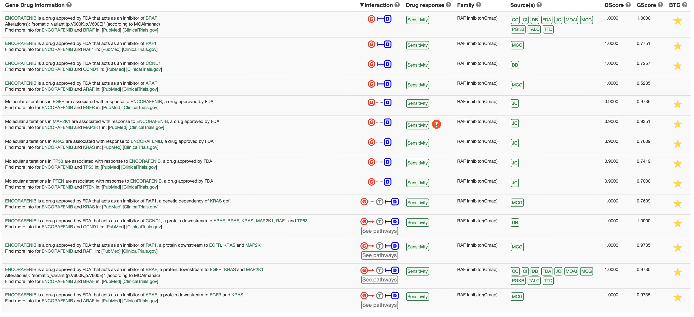
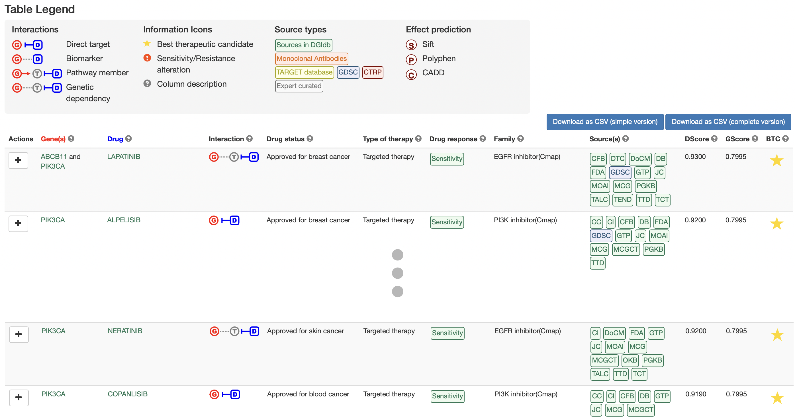

# PanDrugs Help

1. [QUERY OPTIONS](#!/help#query-options)
  1. [Genes](#!/help#genes-query)
  2. [Gene Ranking](#!/help#gene-ranking-query)
  3. [Drugs](#!/help#drugs-query)
  4. [Genomic Variants](#!/help#vcf)

2. [ADVANCED OPTIONS](#!/help#advanced-options)
  1. [Drug status level](#!/help#drugs-status-level)
  2. [Interaction evidence level](#!/help#interaction-evidence-level)
  3. [Select cancer type](#!/help#select-cancer-type)

3. [GScore AND DScore CONCEPT AND CALCULATION](#!/help#gscore-and-dscore-concept-and-calculation)

4. [OUTPUT FOR GENES, GENE RANKING AND GENOMIC VARIANTS](#!/help#output-for-genes-gene-rank-and-vcf)
  1. [Charts](#!/help#drugs-status-level)
    1. [Plot-chart](#!/help#plot-chart)
    2. [Pie-charts](#!/help#pie-charts)
  2. [Summary table](#!/help#summary-table)

5. [OUTPUT FOR DRUGS QUERY](#!/help#output-for-drugs-query)

6. [EXAMPLES](#!/help#examples)
  1. [Genes query](#!/help#examples-genes-query)
  2. [Gene ranking query](#!/help#examples-gene-ranking-query)
  3. [Drugs query](#!/help#examples-drugs-query)
  4. [Genomic Variants](#!/help#examples-vcf)

7. [DATABASE VERSIONS FOR VCF ANNOTATION](#!/help#database-versions-for-vcf-annotation)

## 1. Query Options
There are three possible input options to obtain a **list of therapies according to an individualized genetic profile**:

- A list of gene symbols (Genes query).
- A ranked list of gene symbols (Gene Ranking query).
- A vcf file containing a set of variants corresponding to the GRCh37/HG19 assembly of the human genome (Genomic Variants query).

Another possibility is to query the database to see **which genes are associated with a particular drug**.

### 1.1 Genes
In this modality, the input is a **set of genes that must be introduced using the corresponding Gene Symbols**. Genes can be introduced directly in the text box or can be provided loading a file containing the list of genes. In both cases each gene name must be in a different line.

### 1.2 Gene Ranking
With this search option, it is possible to provide a **ranked list of genes in the RNK (Ranked List) file format**.

This file must be uploaded and must contain an ordered list of genes with two tab delimited columns. The first column contains the HUGO Gene Symbols and the second column contains the corresponding weight. In the process, the weight will be normalized to a 0-1 scale.

### 1.3 Drugs
In this query option, **a specific drug** can be selected in order to explore its connection with the genes in the database. Drugs can be searched in the database by the source name, the standardized drug name or the preferred shown name. When typing the name, the drugs matching the typed characters are shown as suggestions.

### 1.4 Genomic Variants
In this search option, a **vcf file** must be provided. In this file, the genomic coordinates must be expressed in the HG19 assembly of the human genome.

To create a new analysis click on *New variants analysis...* button, select a vcf file, select a name for the job and click on Submit VCF file button.

A message indicating that the computation has been successfully submitted appears, a link to follow the computation progress is provided and a new analysis with an associated progress bar is loaded into the variant analysis box.

As the computation progresses, the completion of the different steps is indicated in the progress bar.

During this process, the VCF file is annotated using the Variant Effect Predictor (VEP) of Ensembl and additional databases. A variant score is computed for each variant. The highest variant score for the principal transcript in each gene is the final GScore.

Finally, when the job is entirely done, results can be selected in order to query PanDrugs database and retrieve the suggested treatments according to the provided profile. In this step it is also possible to download a tab-delimited file with the annotations for each variant and the corresponding score.

If the user is logged in PanDrugs the results of the query are stored in the personal account. In this case the user can access to previous analysis and select one of them to make the query.

## 2. Advanced Options

Those queries based on genes (Genes, Gene Ranking and Genomic Variants) can be adjusted using the panel of advanced options:

## 2.1 Drug status level

Allows to chose those therapeutics options where the drugs are in the approval status selected. The options are:

**Cancer:**

- **FDA approved:** FDA approved drugs used in a cancer treatment.
- **Clinical trials:** Drugs in clinical trials for being used in a cancer treatment.

**Other pathologies:**

- **FDA approved:** FDA approved drugs for conditions or pathologies different from cancer.
- **Clinical trials:** Drugs in clinical trials used in conditions or pathologies different from cancer.
- **Experimental:** Compounds in pre-clinical phase.

By default, all the options appear selected and the results will contain drugs in all the indicated approval status.

## 2.2 Interaction evidence level

Allows to chose those therapeutic options where the gene in the drug-gene association has the selected interaction with the drug. The options are:

**Target:** We consider a gene as a target when it contributes to a disease phenotype and can be targeted directly by a drug. The search will return this type of drug-gene interactions.

**Biomarker:** We consider a gene as a biomarker when its genetic status is associated with a drug response by clinical or pre-clinical evidences. The search will return this type of drug-gene interaction.

By default, all the options appear selected and the returned results will contain both drug-gene associations.

## 2.3 Select cancer type

For the approved drugs in cancer, the tumor type or tumor types they are prescribed for are also indicated. Selecting one or more available cancer categories, only the approved drugs indicated for the selected tumor types will be shown. Additionally, drugs in clinical trials or experimental drugs linked to the genes will be provided.

By default, all the cancer types are selected.

## 3. Gene Score (GScore) and Drug Score (DScore) concept and calculation

The GScore measures the biological relevance of the gene in the tumoral process. It ranges from 0 to 1.

The DScore measures the suitability of the drug according to the genomic profile. It goes from -1 to 1 with the negative values corresponding to resistance and the positive values corresponding to sensitivity.

**GScore calculation**

When the input is a **ranked gene list** where the ranking is based on some experimental results, as for example, data originating from differential expression studies, the introduced values are normalized to the 0-1 scale.

If the input consists of a **non ranked list of genes**, the GScore is calculated according to the relevance of that gene in carcinogenesis. To perform this calculation we consider different aspects as the frequency at which the gene appears in different tumors, the probability of being a driver and the gene essentiality.

When the input is a **vcf file**, the GScore is computed taking into account the annotations provided for the variants located in each gene. Variants are annotated using the information provided by the VEP and other additional sources. The score for each variant (called VScore) is computed taking into account a set of features from these annotations. Variants are then filtered using the consequence indicated by VEP, keeping only those with a relevant impact in the sequence (transcript_ablation, splice_donor_variant, splice_acceptor_variant, stop_gained, frameshift_variant, stop_lost, start_lost, transcript_amplification, inframe_insertion, inframe_deletion, missense_variant, protein_altering_variant, splice_region_variant, incomplete_terminal_codon_variant and stop_retained_variant). Finally, we extract the affected genes and the GScore is established for each of them selecting the highest value of VScore for the principal transcript.

**DScore calculation**

There is a pre-computed DScore in the database for each single drug-gene relation of each source. In its calculation we first take into account the use of the drug in cancer, then the approval status of the drug and finally the definition of the gene as a target or biomarker in the relation with the drug. Experimental compounds have a different score assignation and they rank below drugs in another status, giving more relevance to target than to biomarker genes.

During the assignation process the drug score is readjusted to take into account the information provided by the combination of all input data. We define a **collective gene impact factor**, which reflects the number of genes in the input that points to a particular compound and a **database factor** that reflects the number of expert curated sources that support a particular drug-gene interaction. Pathway member assignations are penalized with respect to direct ones unless a biomarker evidence supports the association.

Experimental compounds maintain the pre-computed DScore with the exception of a penalization for pathway member cases.

In the case one drug has a sensitivity response due to one gene, but a resistance response due to another, the drug assignation appears with the sign of the highest DScore in absolute value. This means that the response with the most relevant evidences is the one that is going to be selected to position the drug in the sensitivity or resistance area.

## 4. Output for Genes, Gene Ranking and Genomic Variants

 The potential therapies are calculated taking into account the global set of genes. That is, if there is a predicted resistance response to a drug based on a particular gene and another gene indicates sensitivity, that drug will be showed with the sign of the highest DScore in absolute value but with a label of both types of response. These indications should be review to decide the suitability in the particular case, as sometimes the sensitivity or resistance response is dependent on a particular type of alteration.

 Once the query has been launched, a summary box with the execution details, some summary charts and a table with the results for the therapeutic assignations appear.

## 4.1 Charts

## 4.1.1 Plot-chart

In this plot-chart the drug assignations are drawn where each point corresponds to a drug.

- Axis: In the X axis is indicated the DScore for each of the drugs and in the Y axis the GScore. Positive values of DScore correspond to sensitivity assignations according to the introduced criteria and negative values for the DScore represent resistance assignations.

- Points: The size of the points is proportional to a GScore/DScore index, the color refers to the approval status of the drug, and the shape defines the type of druge-gene association.

- Best Candidates: Values above 0.7 for the DScore and 0.6 for the GScore establish the Best Candidates area shaded in green.

It is possible to make zoom in the plot and it can be printed or downloaded in different formats (png, jpeg, pdf, svg).

## 4.1.2 Pie-charts

**Drugs by approval status**

This plot shows the percentage of suggested drugs in each of the approval status categories (Approved, Clinical Trials or Experimental).

**Drugs by family**

This plot shows the family categories to which the assigned drugs belong.

These two plots can also be printed or downloaded in different formats (png, jpeg, pdf, svg).

## 4.2 Summary table

In this table, we have the different therapeutic options sorted by default by the DScore and the GScore.

- BEST Therapeutic Candidates are highlighted with a star in the BTC column.
- Alerts: Sometimes, an exclamation mark appears as a warning, indicating that some information based on expert knowledge has to be taken into account.

Table has the following columns:

**1. Gene(s):** the gene or genes from the input list with a match in the database that are related to the proposed therapy. Each gene is linked to the gene detailed information at NCBI.

**2. Drug:** name for the compound. Each drug is linked to detailed information in PubChem.

**3. Interaction:** type of relation between the genes and the drugs. The relation corresponding to the one with the highest DScore and GScore is shown. Options are:

- **Direct:** the altered gene is the target or the biomarker of the drug

  - Target 
  - Biomarker 

- **Pathway member:** the drug has as a target a gene related to the altered one

  

**4. Drug status:** approval status of the drug and the cancer prescription for the approved ones.

**5. Type of therapy:** type of therapy for the approved drugs in cancer. The possible options are:

- **Targeted therapy:** Drugs that precisely identify and attack cancer cells.
- **Chemotherapy:** Drugs that destroy cells that are actively growing.
- **Immunotherapy:** Drugs that boost body's own immune system to fight the disease.
- **Antihormone therapy:** Suppression of certain hormones that can prompt or help in the tumor growth.
- **Photodynamic therapy:** Use of special drugs, called photosensitizing agents, along with light to kill cancer cells.

**6. Drug response:** The sensitivity or resistance response based on the gene alteration.  Alerts are included in this area.

**7. Family:** category of drugs to which the compound belongs. It is based on the target-based classification of drugs provided by KEGG and the Connectivity Map classification.

**8. Source(s):** Source where the drug-genes interaction come from. Each source name links to the resource from where the drug-gene info was obtained. Sources are:

**9. DScore:** score for the drug based on approval status, use in cancer, drug-gene relation, the number of associated genes and curation level of the sources. The highest DScore for each of the drug-gene associations is shown.

If the search is for a drug, this score is the pre-calculated value based on the approval status, use in cancer and drug-gene relation.

**10. GScore:** score for the gene. This score varies depending on the query option:

- **Ranked list of genes:** the score will be the provided in the second column normalized to a 0-1 scale.

- **List of genes:** the score is computed according to the relevance of the gene in carcinogenesis.

- **vcf file:** a score for each of the variants is calculated based on different provided annotations. The gene score for the gene will be the highest score among the variants present in the principal isoform of the gene.

- **Drug query:** the score is computed according to the relevance in carcinogenesis.

In each row, the highest GScore for each of the drug-gene associations with the highest DScore is shown.

**11. BTC:** a star highlights the Best Therapeutic Candidates according to both DScore and GScore.

Each of the rows has **ADDITIONAL INFORMATION** that can be expanded clicking on the plus button. When expanding the assignation, each of the drug-gene interactions involved in the drug assignation is explained. A section with additional information is shown for each of them:

- A sentence explaining the association between the drug and the gene.

- Interaction type: the association between the gene and the drug. A link to the pathways the gene is involved in is shown when the drug-gene association is based on a pathway membership. Clicking on this link shows a pop-up where the pathways are summarized. Clicking in each pathway leads to a visualization in KEGG with the affected and target genes highlighted.

- Alteration: the alteration type that drives the sensitivity/resistance response.

- A link to PubMed and ClinicalTrials.gov for additional information regarding the drug-gene association.

- Also, the sensitivity/resistance response, family, source(s), DScore and GScore for each of the drug-gene interactions summarized in the row are displayed.

- When the input is a vcf file introduced in the Genomic Variants query, information about the annotations for the variant affecting the gene that contributes to the GScore is provided.

## 5. Output for drugs query

In case of consulting the database to extract the genes related to a particular drug, the result consists in a summary table with the same format as for the other queries.

In this case, each of the rows represents each of the genes associated with the input drug. The DScore is the pre-calculated drug score for each drug-gene interaction in the database. The GScore is computed according to the relevance of the gene in carcinogenesis.

See [Summary table](#!/help#summary-table) for further information

## 6. Examples

## 6.1. Genes query

[Load PI3K-AKT-mTOR signaling pathway example](#!/query?tab=genes)

This set of genes contains those involved in the PI3K-AKT-mTOR signaling pathway associated with proliferation.

Clicking on Query button drug assignations are calculated.

**Output interpretation**

In the results page a section with the different graphs and the summary table appears
(see [OUTPUT FOR GENES, GENE RANKING AND GENOMIC VARIANTS](#!/help#output-for-genes-gene-rank-and-vcf) section for the explanation about the components)

Among the best candidates PanDrugs suggests Everolimus and Temsirolimus.

  

Everolimus suggestion is based on (1) target (MTOR) inhibition and (2) biomarkers (TSC1, AKT1, PIK3CA, PTEN, TSC2 and AKT2) of the response. In this case, the MTOR inhibition is strengthened due to besides the fact that this gene is mutated, it is also downstream to affected genes in the pathway (3).

In this case, the warning is about the presence of an alteration in PTEN gene, as PTEN deficiency is associated with reduced sensitivity to mTOR inhibition.

Another possibility is the use of Temsirolimus, another serine/threonine protein kinase inhibitor with different targets among the genes in the list: MTOR - based on (1) direct target and (3) pathway member evidence - and (2) PTEN, PIK3CA, AKT1, TSC2 and TSC1 biomarkers of response.

## 6.2. Gene ranking query 

[Load example for lung adenocarcinoma patient EGFR mutant from TCGA](#!/query?tab=generank)

This example corresponds to a lung adenocarcinoma case (TCGA-91-6847) where the patient harbors a mutation and amplification in EGFR gene. File contains the top 500 highly expressed genes. The values for each gene are the statistic value in the differential expression.

Clicking on Query button the drug assignations are calculated.

**Output interpretation**

In the results page a section with the different graphs and the summary table appears (see [OUTPUT FOR GENES, GENE RANKING AND GENOMIC VARIANTS](#!/help#output-for-genes-gene-rank-and-vcf) section for the explanation about the components)

Output is retrieved in the same way and the results are interpreted as just as in Genes query.

In the particular case of this example, we do not see any result showed in the Best Candidate area as top up-regulated genes do not have any therapy in higher approval status.

If we order by a descending DScore to only obtain sensitivities in the top section of the table, some candidates proposed by PanDrugs as a treatment are Erlotinob or Afatinib, approved drugs for lung cancer. Both are based on different evidences as shown in the detailed breakdown. Also, an alert appear in both cases indicating a possible drug resistance to these compounds according to specific genetic alterations.

Also, other treatments based on pathway members are suggested, as Imatinib and Bosutinib that targets downstream proteins to EGFR, gene that is altered in the patient and that is causing an increased expression in the tumor.

## 6.3. Drugs query

[Load Palbociclib example (Approved drug for targeted therapy in breast cancer)](#!/query?tab=drugs)

Clicking on Query button the associations are retrieved.

**Output interpretation**

In the results page a section with the different graphs and the summary table appears (see [OUTPUT FOR DRUGS QUERY](#!/help#output-for-drugs-query) section for the explanation about the components)

Genes in three different levels of association with Palbociclib are returned as a result for this query.

Genes that are targeted by this drug are for example CDK6, CDK4 or DRD2. Other genes are biomarkers of response, as for example CDKN2A which is associated with sensitivity to Palbociclib or RB1, whose alterations are associated with resistance to this drug.

## 6.4. Genomic Variants

[Load example for melanoma patient BRAF mutant from TCGA](#!/query/?tab=vcfrank)

Clicking on Query button the assignations are calculated.

**Output interpretation**

In the results page a section with the different graphs and the summary table appears (see [OUTPUT FOR GENES, GENE RANKING AND GENOMIC VARIANTS](#!/help#output-for-genes-gene-rank-and-vcf) section for the explanation about the components)

Among the suggested treatments, some approved drugs for this cancer type (skin cancer) are provided as Sorafenib or Vemurafenib which target BRAF. In the extended information, specific data for the variant located in the gene and the evidences for their relevance are shown.

Based on BRAF, but on a biomarker and pathway evidence, TRAMETINIB and COBIMETINIB are strongly associated treatments.

In a repurposing way, the approved drugs for blood cancer DASATINIB or BOSUTINIB are also indicated due to the alterations in BRAF, COL1A1, NTRK1 and PTEN, indirectly targeted through pathway members by these compounds.

## 7. Database versions for VCF annotation 

**Variant Effect Predictor** Ensembl Release 90

**COSMIC** Release v84 for HG19 assembly

**Pfam** 31.0

**UniProt** Release 2018_02

**InterPro** 66.0

**ClinVar** Release 2018_02

**Cancer Gene Census for Cosmic** v84

**APPRIS** (gencode19/ensembl74)

**KEGG** Release 85.1
