# PanDrugs Help

1. **[PanDrugs Queries](#!/help#pandrugs-queries)**
  1. [Gene Names Query](#!/help#genes-query)
  2. [Drug Query](#!/help#drug-query)
  3. [Gene Ranking Query](#!/help#gene-ranking-query)
  4. [CNVs Query](#!/help#cnvs-query)
  5. [Small Variants Query](#!/help#vcf-query)
  6. [Multi-omics Query](#!/help#multi-omics-query)

2. **[Analysis Options](#!/help#analysis-options)**
  1. [Drug Status](#!/help#drugs-status)
  2. [Interaction Type](#!/help#interaction-type)
  3. [Select Cancer Types](#!/help#select-cancer-types)

3. **[PanDrugs Scores](#!/help#pandrugs-scores)**
  1. [DScore Calculation](#!/help#dscore-calculation)
  2. [GScore Calculation](#!/help#gscore-calculation)

4. **[Gene Names, Gene Ranking, CNVs, Small Variants and Multi-omics Query Output](#!/help#genes-gene-rank-cnvs-vcf-and-multi-omics-query-output)**
  1. [Summary Box](#!/help#summary-box)
  2. [Charts](#!/help#charts)
    1. [Scatter Plot](#!/help#scatter-plot)
    2. [Pie Charts](#!/help#pie-charts)
  3. [Summary Table](#!/help#summary-table)
  4. [PanDrugs Report](#!/help#report)

5. **[Drug Query Output](#!/help#drug-query-output)**

6. **[Examples](#!/help#examples)**
  1. [Gene Names Analysis](#!/help#examples-genes-query)
  2. [Drug Analysis](#!/help#examples-drug-query)
  3. [Gene Ranking Analysis](#!/help#examples-gene-ranking-query)
  4. [CNVs Analysis](#!/help#examples-cnvs-query)
  5. [Small Variants Analysis](#!/help#examples-vcf-query)
    1. [Small Variants Analysis with Somatic Alterations](#!/help#examples-vcf-query-somatic-variants)
    2. [Small Variants Analysis with Somatic and Germline Alterations](#!/help#examples-vcf-query-somatic-germline-variants)
      1. [Small Variants Analysis without PharmCAT](#!/help#examples-vcf-query-no-pharmcat)
      2. [Small Variants Analysis with PharmCAT](#!/help#examples-vcf-query-pharmcat)
  6. [Multi-omics Analysis](#!/help#examples-multi-omics-query)
    1. [Multi-omics Analysis without VCF](#!/help#examples-multi-omics-query-wo-vcf)
    2. [Multi-omics Analysis with VCF](#!/help#examples-multi-omics-query-w-vcf)

## 1. PanDrugs Queries
There are five types of queries to obtain a **rank of therapies according to an individualized genomics profile**, depending on the input data:

  - **[Gene names query](#!/help#genes-query):** Using a list of altered genes as input.
  - **[Gene ranking query](#!/help#gene-ranking-query):** Using a ranked list of altered genes in .rnk format.
  - **[CNVs query](#!/help#gene-ranking-query):** Using a list of altered genes and their CNV status in .tsv format.
  - **[Small variants query](#!/help#vcf-query):** Using a VCF containing a set of somatic (and optionally germline) variants corresponding to the GRCh38 assembly of the human genome.
  - **[Multi-omics query](#!/help#multi-omics-query):** Using at least two of these inputs:
    
    - A .tsv compatible with a CNVs query.
    - A VCF compatible with a small variants query.
    - A .rnk file with genes ranked according to their expression change between tumour and normal samples.

Another possibility is to make a **[drug query](#!/help#drug-query)** to find out which genes are associated with a particular drug.

### 1.1 Gene Names Query
In this modality, the input is a **set of gene symbols** that can be pasted directly into the text box or uploaded as a file **without a header**. **In both cases, each gene symbol must appear in a different line**.

### 1.2 Drug Query
**A single drug** can be queried to explore its connection with the genes in the database. PanDrugsdb contains information about drug synonyms. So, as you type a drug name, several suggestions matching your query will appear.

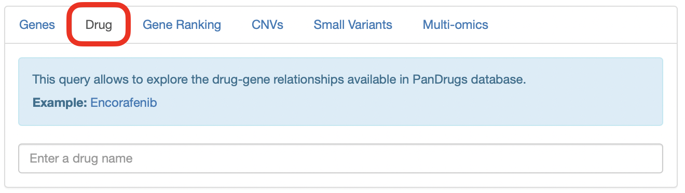

### 1.3 Gene Ranking Query
In this type of query, it is possible to upload a **ranked list of genes as a [.rnk file](https://software.broadinstitute.org/cancer/software/gsea/wiki/index.php/Data_formats#RNK:_Ranked_list_file_format_.28.2A.rnk.29)**.

This file must consist of two tab-delimited columns containing gene symbols and the ranking metric, respectively. Each gene symbol must appear in a different line. 

The ranking metric will be scaled between 0 and 1 and will be treated as a user-supplied [GScore](#!/help#gscore-calculation), overwriting the pre-computed one.

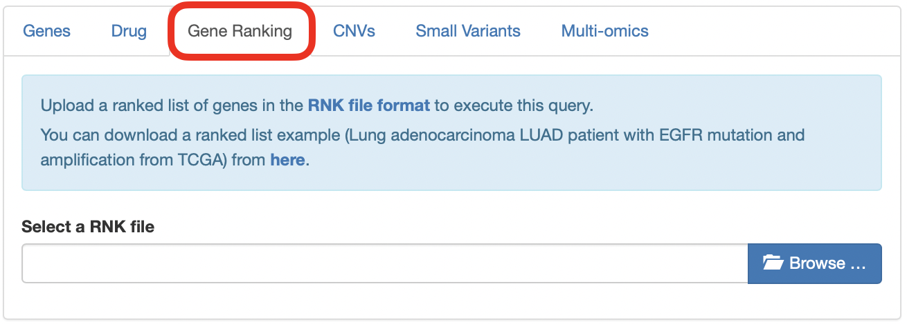

### 1.4 CNVs Query
In this modality, you can upload a **tab-delimited file without headers** formed by two columns. The first one must contain a **gene symbol** per line. The second column must indicate the **CNV status** of the corresponding gene (either "AMP" for amplification or "DEL" for deletion). **Diploid genes must not be listed in this file**.

### 1.5 Small Variants Query
In this type of query, you must upload a **[VCF](https://samtools.github.io/hts-specs/VCFv4.2.pdf)** containing somatic and, optionally, germline variants. The genomic coordinates in this VCF must correspond to the GRCh38 assembly of the human genome.

**If the input VCF contains germline variants, there is an option to run [PharmCAT](https://pharmcat.org) and include the [Clinical Pharmacogenetics Implementation Consortium (CPIC)](https://cpicpgx.org) guidelines in the final ranking returned by PanDrugs**. To do so, the **input VCF must contain genotype data with one or two sample columns**. These are the two accepted formats:

- **Ideally**, a VCF with **two sample columns named "tumor" and "normal"** detailing the genotypes of the corresponding variant in each sample. Please note that, while the order of the sample columns is indifferent, **the names must be exactly "tumor" and "normal"**.
- A VCF with a **single sample column** containing somatic and germline variants all together. In this case, **there are no requirements regarding the name of the sample column**.

To create a new analysis, click on **New variants analysis...** and then select a valid VCF file. You can click on **PharmCAT analysis** and optionally upload a .tsv file with genotypes called outside PharmCAT. Moreover, you can provide a meaningful name for the job. Finally, click on **Submit VCF**.

A message indicating that the computation has been successfully submitted will appear. In this message, you will get a link to follow the computation progress.

Moreover, if you come back to the **Small Variants** tab or follow the link, you will notice a progress bar associated with your job. As the computation progresses, the completion of the different steps will be indicated in this progress bar.

During this process, the somatic variants included in the VCF are annotated using Ensembl's [Variant Effect Predictor (VEP)](https://www.ensembl.org/info/docs/tools/vep/index.html) and additional databases. With these annotations, a Variant Score (VScore) is computed for each variant. The final GScore is then calculated as the maximum VScore for the principal transcript of each gene.

If you clicked on **PharmCAT analysis**, the germline variants will be used to query PharmCAT to retrieve the CPIC recommendations.

Finally, when the progress bar is complete, you can query PanDrugsdb and obtain a ranking of treatments **tailored to the provided genomics profile**. If you clicked on **PharmCAT analysis**, PanDrugs output will contain CPIC guidelines (if any) for the ranked drugs and a link to PharmCAT's report.

Moreover, it is possible to download a tab-delimited file with the annotations for each somatic variant and the corresponding VScore by clicking on **Download VScores** or the PharmCAT report by clicking on **PharmCAT report**.

If you are logged in PanDrugs, the results of the query will be stored in your account. You will be able to access any previous analyses done within the last 6 months and select one of them to make a new query. You can register [here](https://pandrugs.sing-group.org/#!/login). **Note that the germline variants used to query PharmCAT are deleted immediately and are not stored in our servers**.

### 1.6 Multi-omics Query
You can perform a multi-omics query in case you have at least two of these inputs for the same patient:

  - CNV data.
  - A VCF.
  - Expression data.

In this type of query, the expression data can be uploaded as a **[.rnk file](https://software.broadinstitute.org/cancer/software/gsea/wiki/index.php/Data_formats#RNK:_Ranked_list_file_format_.28.2A.rnk.29)**.

This file must consist of two tab-delimited columns containing gene symbols and the ranking metric, respectively. Each gene symbol must appear in a different line and **the ranking metric must reflect the expression change between tumour and normal samples** (e.g. a differential expression test statistic).

The files containing CNV information and the VCF must be as detailed in sections [CNVs Query](#!/help#cnvs-query) and [Small Variants Query](#!/help#vcf-query), respectively.

If expression data is available, PanDrugs will compute the 90th percentile of the expression metric and will assign an expression label to each gene in the .rnk file:

- **Highly Overexpressed:** Genes with an expression metric above the 90th percentile.
- **Overexpressed:** Genes with an expression metric > 0.
- **Underexpressed:** Genes with an expression metric < 0.
- **Not Expressed:** Genes with no expression information (i.e. genes that appear in any other input).

Then, PanDrugs will query its database with the genes with known CNV status information, if available. Moreover, if there is a VCF, PanDrugs runs a small variants query (with an optional call to PharmCAT) as [detailed before](#!/help#vcf-query). The output table will contain annotations for each drug-associated gene, including its SNV, CNV and expression status, when available.

## 2. Analysis Options

Those queries based on genes ([gene names](#!/help#genes-query), a [gene ranking](#!/help#gene-ranking-query), [CNVs](#!/help#cnvs-query) and [small variants](#!/help#vcf-query)) can be adjusted using the panel of analysis options.

PanDrugs2 includes two analysis modes: the **clinical mode**, which filters out experimental drugs and pathway member associations from the query results, and the **discovery mode**, which allows the selection of all possible filters to expand the therapeutic options suggested by PanDrugs.

### 2.1 Drug Status

Allows filtering therapeutic options according to their approval status for cancer or other pathologies. The options are:

**Cancer:**

- **FDA approved:** FDA-approved drugs for cancer treatment.
- **Clinical trials:** Drugs in clinical trials for cancer treatment.

**Other pathologies:**

- **FDA approved:** FDA-approved drugs for other conditions or pathologies.
- **Clinical trials:** Drugs in clinical trials for the treatment of other conditions or pathologies.
- **Experimental:** Compounds in the pre-clinical stage.

By default, the clinical mode is selected so the results include approved drugs or drugs in clinical trials for cancer or other pathologies.

### 2.2 Interaction Type

Allows filtering therapeutic options according to the type of drug-gene interaction:

- **Direct target:** Show drugs that directly target any input gene that contributes to a disease phenotype (e.g. *BRAF* is a direct target of vemurafenib).

- **Biomarker:** Show drugs whose response is associated, based on clinical or pre-clinical evidence, with the genetic status of any input gene (e.g. *BRCA*-mutated cancers responding to PARP inhibitors).

- **Genetic dependency**: Show drugs that target any druggable gene upon which an input gene functionally depends (e.g. patients with *BRAF* GoF treated with BRAF and MEK inhibitors can develop resistance involving MAPK signalling reactivation. Thus, PanDrugs suggests targeting *MAP2K1* in tumours with *BRAF* GoF).

- **Pathway member:** Show drugs that target any downstream druggable genes within the pathway of the input genes (e.g. patients with mutations in *TSC1/2* respond to downstream inhibition of the mTOR pathway).

By default, the clinical mode is selected so the results include all types of drug-gene interactions except for pathway members.

### 2.3 Select Cancer Types

Allows to filter therapeutic options **approved for specific cancer types**. **Drugs in clinical trials or experimental drugs associated with the input genes will be shown independently of this filter**. If you want your output to only contain approved drugs for the selected cancer types, **you must also filter by FDA-approved drugs for cancer** (see [Drug Status](#!/help#drugs-status-level) section).

By default, all cancer types are selected.

## 3. PanDrugs Scores

PanDrugs **ranks the results based on** two scores: the **Drug Score (DScore)** and the **Gene Score (GScore)**.

- The **DScore** measures the **suitability of the treatment** according to the drug indication and status, type of drug-gene association and curation level of the sources. It **ranges from -1 to 1**, with the negative values corresponding to resistance and the positive values corresponding to sensitivity.

- The **GScore** measures the **biological relevance of a gene in the tumoral process and its druggability**. It is estimated according to gene essentiality, tumor vulnerability, relevance of the gene in cancer, its druggability level, the biological impact of mutations, the frequency of gene alterations and their clinical implications. The GScore **ranges from 0 to 1**.

### 3.1 DScore Calculation

This score has been calculated according to the drug indication for cancer or other diseases, its approval status and the type of direct drug-gene association (direct target or biomarker). Moreover, the sign of the pre-computed DScore indicates the direction of the drug response (sensitivity or resistance).

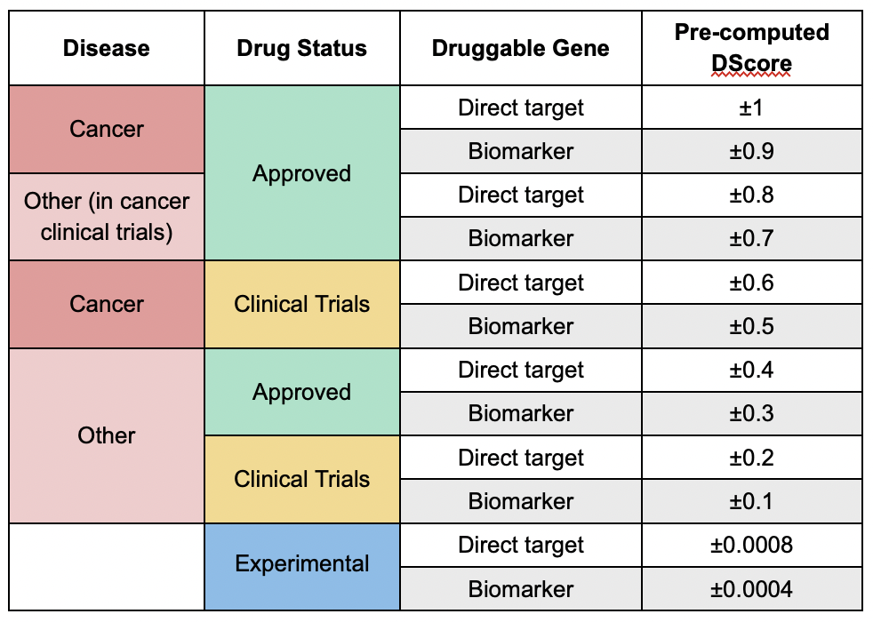

The final DScore reported by PanDrugs depends on the type of query:
  
  - **After a Drug Query:** The table shows the pre-computed DScore of each drug-gene association.

  - **After any other query:** The table shows a final DScore for each individual drug. PanDrugs modifies the pre-computed DScore in absolute value to account for the approval status of the drug, the number of associated genes, their interactions with the drug and the curation level of the sources. The final DScore is then assigned to the maximum modified pre-computed DScore in absolute value multiplied by its original sign. If there are two maximum values with an opposed sign, the final DScore will be positive. Moreover, if the mutation of a drug-associated gene confers **resistance** to the drug and the alteration of another associated gene indicates **sensitivity**, that drug will be assigned the label **both**.

### 3.2 GScore Calculation

PanDrugsdb stores pre-computed GScores for each gene symbol. This score has been calculated according to gene essentiality, tumour vulnerability, the relevance of the gene in cancer and its druggability level.

Depending on the type of query, the GScore can suffer modifications:
  
  - **After a drug, gene names or CNVs query:** The GScore is equal to the pre-computed GScore.

  - **After a gene ranking query:** The GScore is computed by scaling the ranking metric between 0 and 1.

  - **After a small variants query:** A Variant Score (VScore) is computed for each variant taking into account their biological impact, their frequency, their clinical implications and the pre-computed GScore of the corresponding gene. The GScore is then calculated as the maximum VScore for the principal isoform of each gene.

  - **After a multi-omics query:** There can be two types of GScores:

    - **For the variants in the VCF:** The GScore is computed from VScores as in a small variants query.
    - **For the genes in the CNV file:** The GScore is computed as in a CNVs Query.

    If a gene has small variants and CNVs, the GScore computed from VScores has priority over the other GScore.
  
Except for the drug queries, the final PanDrugs ranking shows a collapsed GScore for each treatment, which is the maximum GScore among all drug-gene associations. PanDrugs collapsed table can be expanded to retrieve each individual GScore.

## 4. Gene Names, Gene Ranking, CNVs, Small Variants and Multi-omics Query Output

Once the query has been completed, a downloadable report with top results, a summary box with the execution details, some plots and a summary table with a drug ranking will appear.

### 4.1 Summary Box

This box details the total number of queried genes as well as the number of genes present and absent in PanDrugsdb. Morever, it specifies the type of query in the title and the [analysis options](#!/help#analysis-options) that were selected. If you made a [small variants query](#!/help#vcf-query) with a **PharmCAT analysis**, the full PharmCAT's report will be available for download at the summary box.

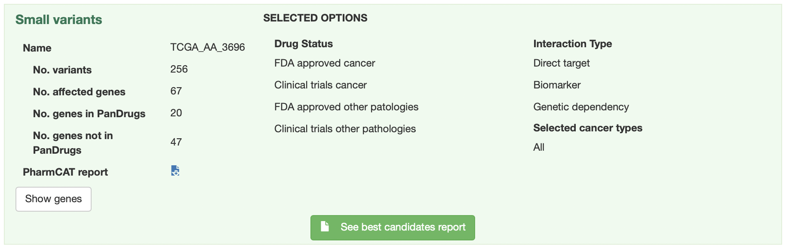

### 4.2 Charts

#### 4.2.1 Scatter Plot

In this plot, the x and y axes represent the DScore and GScore for each drug, respectively. Positive values of the x axis correspond to sensitivity assignations and negative values represent resistance associations.

The ranked therapies are plotted as points with different shapes, colors and sizes:

- **Shape** indicates the type of drug-gene association.
- **Color** indicates the approval status of the drug.
- **Size** is proportional to the final GScore/DScore ratio.

Moreover, we define two thresholds: DScore = 0.7 and GScore = 0.6 to divide the scatter plot into quadrants. The area above both thresholds is shaded in green and includes the drugs labelled as **Best Therapeutic Candidates (BTCs)**.

You can click and drag the cursor to select any plot region you want to zoom in. In addition, the scatter plot can be printed or downloaded in different formats (PNG, JPEG, PDF or SVG) by clicking on this icon: .

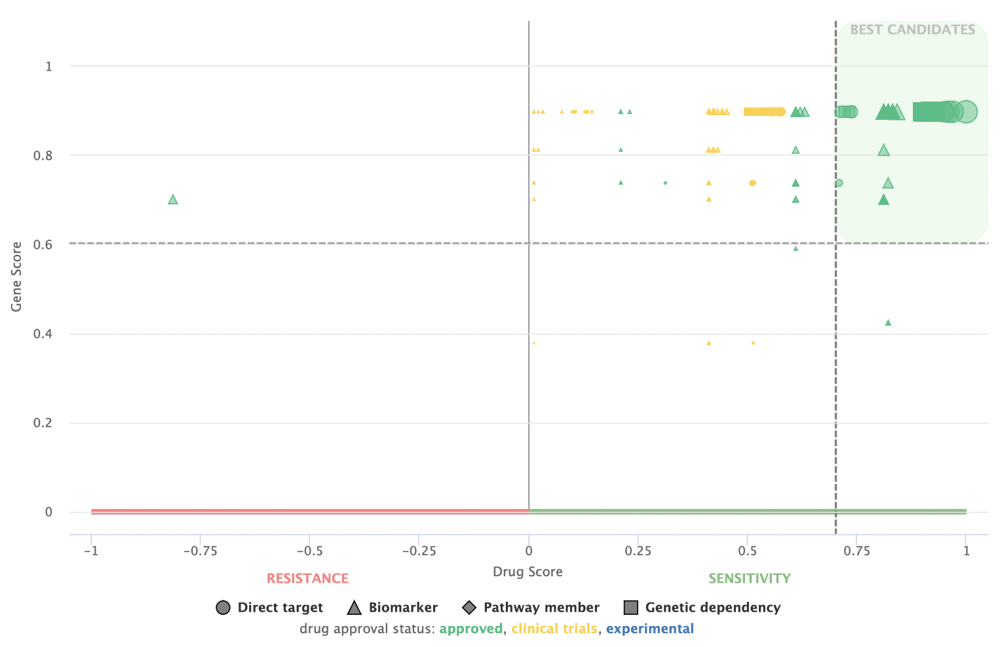

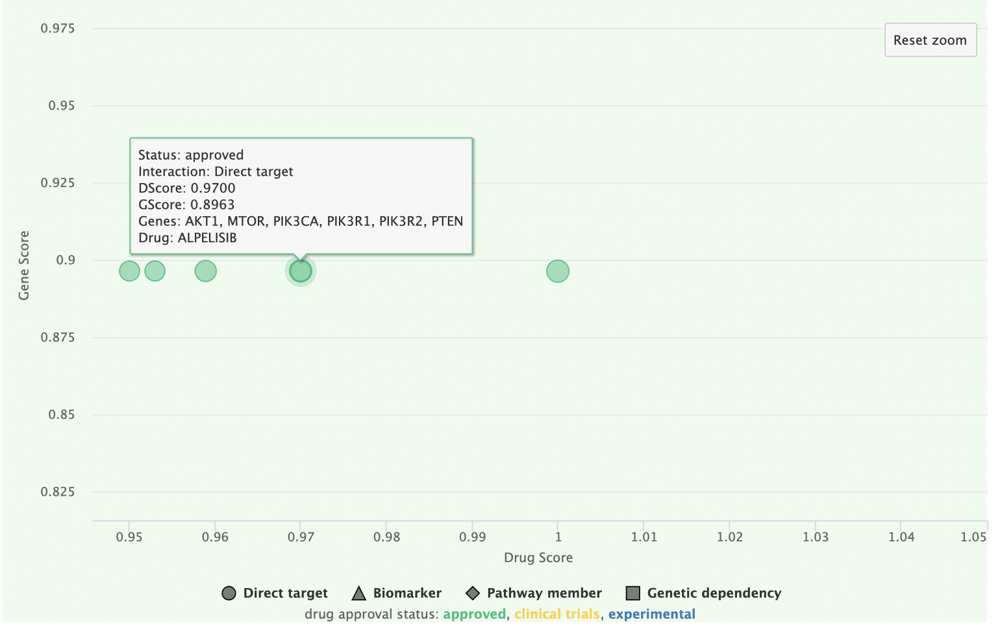

#### 4.2.2 Pie Charts

**Drugs by approval status**

This chart shows the percentage of ranked therapies in each approval status group (Approved, Clinical Trials or Experimental).

**Drugs by family**

This chart shows the percentage of ranked therapies that belongs to each drug family.

These two charts can also be printed or downloaded in different formats (PNG, JPEG, PDF or SVG) by clicking on this icon: .

### 4.3 Summary Table

The summary table shows the therapeutic options returned by PanDrugs ranked first by DScore and then by GScore. This table has the following columns:

**1. Gene(s):** Queried genes that have an association with the corresponding drug in PanDrugsdb. Each gene symbol is linked to its page at the [NCBI](https://www.ncbi.nlm.nih.gov/gene).

**2. Drug:** Compound's name. Each drug is linked to its page in [PubChem](https://pubchem.ncbi.nlm.nih.gov).

**3. Interaction:** Type of drug-gene association. The value of this column in the collapsed table corresponds to the drug-gene pair with the highest DScore and GScore. Options are:

  - **Direct:** The altered gene is the target or the biomarker of the drug.

    - **Direct target **
    - **Biomarker **

  - **Indirect:** The drug's target is a gene related to the altered one.

    - **Genetic dependency**
    - **Pathway member**

**4. Drug status:** Approval status and cancer prescription for the approved drugs.

**5. Type of therapy:** Only available for drugs approved for cancer treatment. Options are:

- **Chemotherapy:** Drugs that kill fast-growing cells.
- **Targeted therapy:** Drugs that specifically attack cancer cells.
- **Hormone therapy:** Suppression of certain hormones that can prompt or help in tumour growth.
- **Immunotherapy:** Drugs that boost or change how the immune system works to fight against cancer.
- **Photodynamic therapy:** Use of light-sensitive drugs, called photosensitizing agents, along with light to kill cancer cells.
- **Combination therapy:** Use of drug combinations to treat cancer. These therapies are treated as one-drug therapies in PanDrugsdb creation, Drug Score (DScore) calculation and Gene Score (GScore) collapsing.

**6. Drug response:**  or  response, based on the gene alteration. Alerts are included in this area:

  -  If there is a predicted **resistance** response to a drug based on a particular gene and another gene indicates **sensitivity**, that drug will be assigned the label **both** in the Drug response column. These indications should be reviewed to decide drug's suitability for a particular case, as sometimes the **sensitivity** or **resistance** response is dependent on a particular type of alteration. Likewise, if some a gene alteration is associated with **sensitivity** and another alteration in the same gene indicates **resistance**, the drug reponse for that gene, and thus for the drug, will be **both**
  -  Sometimes, an exclamation mark appears as a warning, indicating that some information based on expert knowledge has to be taken into account.

**7. Family:** Drug family to which the compound belongs to. It is based on the [KEGG's Target-based Classification of Drugs](https://www.genome.jp/kegg-bin/get_htext?br08310.keg) and the [Connectivity Map (CMAP)](https://www.broadinstitute.org/connectivity-map-cmap) classification.

**8. Source(s):** Source(s) where the drug-gene association comes from. Each source name links to the original resource. Sources are:

  

**9. DScore:** Measures the suitability of the treatment. It ranges from -1 to 1, with the negative values corresponding to resistance and the positive values corresponding to sensitivity. For further information, please refer to [DScore Calculation](#!/help#dscore-calculation) section.

**10. GScore:** Measures the biological relevance of the gene in the tumoral process and its druggability. It ranges from 0 to 1. For further information, please refer to [GScore Calculation](#!/help#gscore-calculation) section.

**11. BTC:** The Best Therapeutic Candidates, with DScore > 0.7 and GScore > 0.6, are highlighted with a yellow star  in the BTC column.
  
**12. PharmCAT:** This column will appear after a [small variants query](#!/help#vcf-query) or a [multi-omics query](#!/help#multi-omics-query) with **PharmCAT analysis**. The drugs with CPIC recommendations will be labelled with one of these icons:

  -  **Strongly Recommended:** There is **strong** evidence to **recommend** the administration of this drug according to patient's germline variants.
  -  **Moderately Recommended:** There is **moderate** evidence to **recommend** the administration of this drug according to patient's germline variants.
  -  **Warning:** There are **several recommendations** for the same drug-variant association. These indications should be reviewed to decide which recommendation to follow based on the patient's population. 
  -  **Moderately not Recommended:** There is **moderate** evidence to **not recommend** the administration of this drug according to patient's germline variants.
  -  **Strongly not Recommended:** There is **strong** evidence to **not recommend** the administration of this drug according to patient's germline variants.

  All these icons are linked to the corresponding drug section in PharmCAT's report, which further explains the administration recommendation. The full PharmCAT's report can be downloaded from the [summary box](#!/help#summary-box).

**13. SNV:** This column will appear after a [multi-omics query](#!/help#multi-omics-query) with a VCF. A drug will be labelled with this icon  when any of its associated genes presents a somatic variant.

**14. CNV:** This column will appear after a [multi-omics query](#!/help#multi-omics-query) with a CNV file or a [CNVs query](#!/help#cnvs-query). A drug will be labelled with this icon  when any of its associated genes presents a CNV (either an  or ).

**15. Expression:** This column will appear after a [multi-omics query](#!/help#multi-omics-query) with expression data. A drug will be labelled with this icon  when any of its associated genes is labelled as

  -  Highly Overexpressed
  -  Overexpressed
  -  Underexpressed

Each row has **ADDITIONAL INFORMATION** that can be expanded clicking on the  button. Columns 6, 8 to 10 and 13 to 15 are further detailed for each gene involved in the drug assignation. Moreover, a new section for each gene is shown on the left. This section contains:

  - A sentence explaining the association between the drug and the gene.

  - The type of drug-gene ineraction for that gene. When this interaction is of type pathway member , there is a button that shows a pop-up with a summary of the KEGG pathways the gene is involved in. Each pathway name has a link to a KEGG's visualization with the affected and targeted genes highlighted.

  - The type of alteration that drives the **sensitivity**/**resistance**/**both** drug response.

  - A link to [PubMed](https://pubmed.ncbi.nlm.nih.gov) and [ClinicalTrials.gov](https://clinicaltrials.gov/ct2/home) with additional information regarding the drug-gene association.

  - **After a query with a VCF (either a [small variants](#!/help#vcf-query) or [multi-omics query](#!/help#multi-omics-query)):** Annotations for the variant affecting the gene are provided.

  - **After a [multi-omics query](#!/help#multi-omics-query):** A sentence explaning the coherence between the alterations found in the different input files is provided.

### 4.4 PanDrugs Report

After a [small variants query](#!/help#vcf-query), a downloadable report with PanDrugs' top results will appear on the top of the page. This report is aimed to support clinical decision-making and comprises two sections:

- **Summary section:** A brief overview of PanDrugs results, including information detailed in the [Summary Box](#!/help#summary-box) and [Charts](#!/help#charts) sections.

- **Best Therapeutic Candidates section:** This section contains a table with the BTCs annotated with their approval status, type of therapy, response, drug family, their actionable variants and the type of drug-gene association.

## 5. Drug Query Output

After making a [drug query](#!/help#drug-query) to retrieve the genes associated with a particular drug, the result consists of a summary box and a summary table similar to the one returned by other types of queries.

In this case, the summary box details the genes associated with the input drug according to PanDrugsdb. Moreover, it specifies the drug status and type of therapy.

In the [summary table](#!/help#summary-table), each row represents a gene associated with the input drug. The reported DScore and GScore are the pre-computed ones.

## 6. Examples

### 6.1. Gene Names Analysis

Load **Example 3** from the [genes query tab.](#!/query?tab=genes)

This list contains the genes involved in the PI3K-AKT-mTOR signaling pathway, which plays an important role in proliferation.

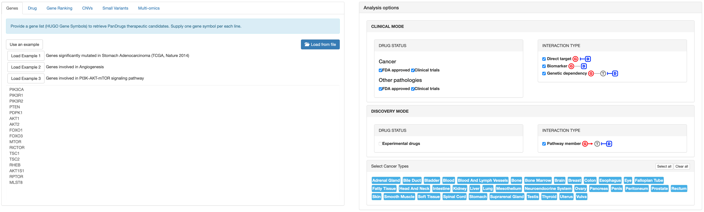

Select **Pathway member** in the **Analysis options** panel and click on the **Query** button.

<u>**Output Interpretation**</u>

In the results page, you will see a summary box with the execution details, some plots and a summary table with the drug ranking (see [Gene Names, Gene Ranking, CNVs, Small Variants and Multi-omics Query Output](#!/help#genes-gene-rank-cnvs-vcf-and-multi-omics-query-output) section for further details).

Among the Best Therapeutic Candidates , PanDrugs suggests alpelisib and temsirolimus.

<!--

-->

If you take a look at the summary table, you will see that these two drugs have the highest DScore and GScore in the ranking. Also, they have multiple associations with several input genes, being the ones with the highest DScore and GScore:

- A direct target  for alpelisib.
- A pathway member  for temsirolimus.

Moreover, temsirolimus and alpelisib are both targeted therapies approved for cancer and belong to the PI3K inhibitor and mTOR inhibitor families respectively.

If you expand temsirolimus row by clicking on the  button you will notice that this drug suggestion is based on:

1. A pathway member association with *AKT1*, *AKT2*, *PDPK1*, *PIK3CA*, *PIK3R1*, *PIK3R2*, *RHEB*, *TSC1* and *TSC2*, which are upstream of the direct target *MTOR*. You can click on **See pathways** to retrieve more information regarding the functional pathways in which they are involved.
2. A direct target inhibition: *MTOR*.
3. Three response biomarkers: *PIK3CA*, *PTEN* and *AKT*.

You may also notice one alert  in the **Drug response** column. This alert indicates that a *PTEN* deficiency is associated with reduced sensitivity to the drug.

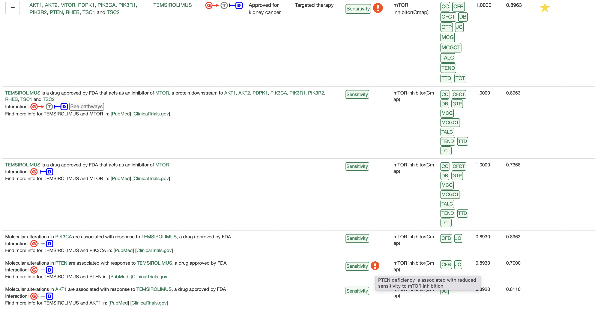

### 6.2. Drug Analysis

[Query encorafenib](#!/query?tab=drugs).

Encorafenib is a targeted therapy approved for the treatment of colon, rectum and skin cancer.

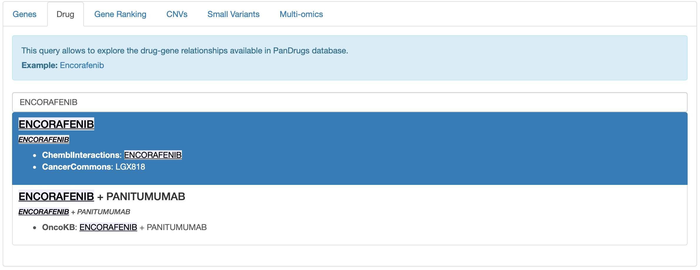

Click on the **Query** button.

<u>**Output Interpretation**</u>

On the results page, you will see a summary box and a summary table similar to the one returned by other types of queries (see [Drug Query Output](#!/help#drug-query-output) section for further details).

In the summary table, each row represents a gene associated with encorafenib. We can observe examples for each type of drug-gene association:

- **Direct targets:** Such as *BRAF*, *RAF1*, *CCND1* and *ARAF*.
- **Biomarkers:** Such as *EGFR*, *MAP2K1*, *KRAS*, *TP53* or *PTEN*. Notice that the *MAP2K1* entry has an alert  that indicates that a *MAP2K1* mutation (V211D) may induce drug resistance to encorafenib.
- **Genetic dependencies:** Such as *KRAS* (GoF) and *RAF1*.
- **Pathway members:** Such as *CCND1*, which is a direct target downstream of *ARAF*, *BRAF*, *KRAS*, *MAP2K1*, *RAF1* and *TP53*. Note that *CCND1* GScore as a pathway member (DScore = 1) is different from its score as a direct target (DScore = 0.7257) since the first one is computed as the maximum GScore of all upstream genes.

### 6.3. Gene Ranking Analysis

[Load example for a non-small cell lung adenocarcinoma patient from the TCGA.](#!/query?tab=generank)

This example corresponds to patient [TCGA-91-6847](https://www.cbioportal.org/patient?studyId=luad_tcga_pan_can_atlas_2018&caseId=TCGA-91-6847), who harbors an amplification in *EGFR* that leads to an increased expression of this gene. The example .rnk file contains the top 500 highly expressed genes. The ranking metric in this case is the statistic of the differential expression test.

Load the .rnk file, select all **discovery mode** filters in the **Analysis options** panel and click on the **Query** button.

<u>**Output Interpretation**</u>

On the results page, you will see a summary box with the execution details, some plots and a summary table with the drug ranking (see [Gene Names, Gene Ranking, CNVs, Small Variants and Multi-omics Query Output](#!/help#genes-gene-rank-cnvs-vcf-and-multi-omics-query-output) section for further details).

These results can be interpreted as the ones obtained after a [gene names analysis](#!/help#examples-genes-query), but keep in mind that the GScores are dependent on the input ranking metric.

For this example, PanDrugs finds a handful of Best Therapeutic Candidates  with GScores = 1. 

<!--

-->
Please, order the summary table by descending GScore to visualize the results.

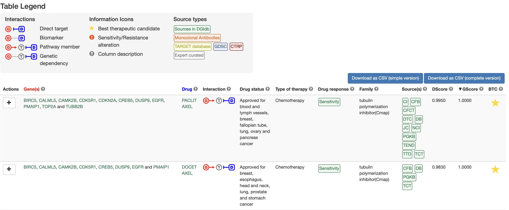

If we take a closer look at the .rnk file and expand any row by clicking on the  button, we will notice that the gene that is driving these results is the top most overexpressed one: *CALML5*, with a GScore = 1.

This gene has no direct association with any drug in PanDrugsdb. Nevertheless, *CALML5* is involved in a lot of different pathways and some of its downstream genes are direct targets of PanDrugs therapies. Thus, all these Best Therapeutic Candidates are obtained via pathway member  associations.

### 6.4 CNVs Analysis

[Load example for a breast invasive ductal carcinoma patient from the TCGA.](#!/query?tab=cnv)

This example corresponds to patient [TCGA-D8-A1JD](https://www.cbioportal.org/patient?studyId=brca_tcga_pan_can_atlas_2018&caseId=TCGA-D8-A1JD), who harbours a deletion in the *BRCA2* gene that leads to the decreased expression of this gene. The example file contains all the CNVs detected for this patient.

Load the example file, **do not** modify any of the **Analysis options** and click on the **Query** button.

<u>**Output Interpretation**</u>

On the results page, you will see a summary box with the execution details, some plots and a summary table with the drug ranking (see [Gene Names, Gene Ranking, CNVs, Small Variants and Multi-omics Query Output](#!/help#genes-gene-rank-cnvs-vcf-and-multi-omics-query-output) section for further details).

These results can be interpreted as the ones obtained after a [gene names analysis](#!/help#examples-genes-query).

In this case, PanDrugs finds several Best Therapeutic Candidates  with GScores = 0.7338. 

<!--

-->
Please, order the summary table by descending GScore to visualize the results.

All these Best Therapeutic Candidates are driven by *RB1* (GScore = 0.7338). The first result is everolimus, a targeted therapy approved for breast cancer that has *RB1* and *BRCA2* as biomarkers of drug response. If we expand the everolimus row by clicking on the , we'll confirm that these two genes are deleted in this patient.

We know that patients with a deletion in *BRCA2* are susceptible to PARP inhibitors. If we scroll down the table, we'll discover some drugs from this family that have a biomarker  association with *BRCA2* and a DScore > 0.7. However, as *BRCA2* is not a direct target of PARP inhibitors, its GScore is below the threshold for defining Best Therapeutic Candidates (GScore < 0.6).

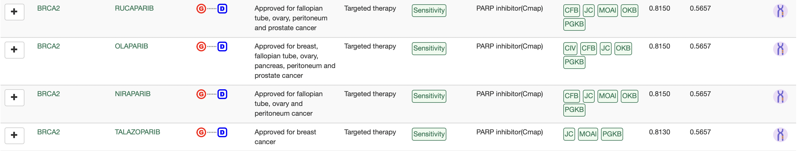

### 6.5. Small Variants Analysis

#### 6.5.1 Small Variants Analysis with Somatic Alterations

[Load example for a breast invasive ductal carcinoma patient from the TCGA.](#!/query?tab=vcfrank)

This example corresponds to patient [TCGA-D8-A1JD](https://www.cbioportal.org/patient?studyId=brca_tcga_pan_can_atlas_2018&caseId=TCGA-D8-A1JD), who harbours two mutations in *PIK3CA*. The VCF contains the patient's somatic variants without any germline alteration, so we cannot select **PharmCAT analysis**.

First, load the VCF, do not click on **PharmCAT analysis** and click on the **Submit VCF** button. 

If you come back to the small variants tab, you will notice a progress bar associated with your job. As the computation progresses, the completion of the different steps will be indicated in here. In this example, PanDrugs will annotate the somatic variants and compute GScores from VScores. For more details, please refer to the [Small Variants Query](#!/help#vcf-query) section.

When the progress bar is complete, **do not** modify any of the **Analysis Options** and click on the **Query with affected genes** button. Please note that, at this point, it is also possible to download a tab-delimited file with the annotations for each somatic variant and the corresponding VScore by clicking on **Download VScores**.

<u>**Output interpretation**</u>

On the results page, you will see a summary box with the execution details, some plots and a summary table with the drug ranking (see [Gene Names, Gene Ranking, CNVs, Small Variants and Multi-omics Query Output](#!/help#genes-gene-rank-cnvs-vcf-and-multi-omics-query-output) section for further details).

These results can be interpreted as the ones obtained after a [gene names analysis](#!/help#examples-genes-query), but keep in mind that these GScores also take into account the biological impact, the frequency and the clinical implications of the somatic variants in the VCF.

PanDrugs returns several Best Therapeutic Candidates  associated with *PIK3CA*.

<!--

-->
Among these Best Therapeutic Candidates, there are PI3K inhibitors such as alpelisib and copanlisib.

If we expand any of these rows by clicking on the , we'll confirm that *PIK3CA* is indeed mutated in this patient. Moreover, PanDrugs details the specific mutation that drives *PIK3CA* GScore.

PanDrug's report with the BTCs is available at the top of the page.

<!-- Update image -->

#### 6.5.2 Small Variants Analysis with Somatic and Germline Alterations

##### 6.5.2.1 Small Variants Analysis without PharmCAT

[Load example for a colon adenocarcinoma patient from the TCGA with synthetic germline variants.](#!/query?tab=vcfrank)

This example corresponds to patient [TCGA-AA-3696](https://www.cbioportal.org/patient?studyId=coadread_tcga&caseId=TCGA-AA-3696), who harbours two mutations in *KRAS* and *PIK3CA*. The VCF contains patient's somatic variants as well as made up germline variants to simulate how PharmCAT analysis would enrich the final drug ranking in a real case scenario.

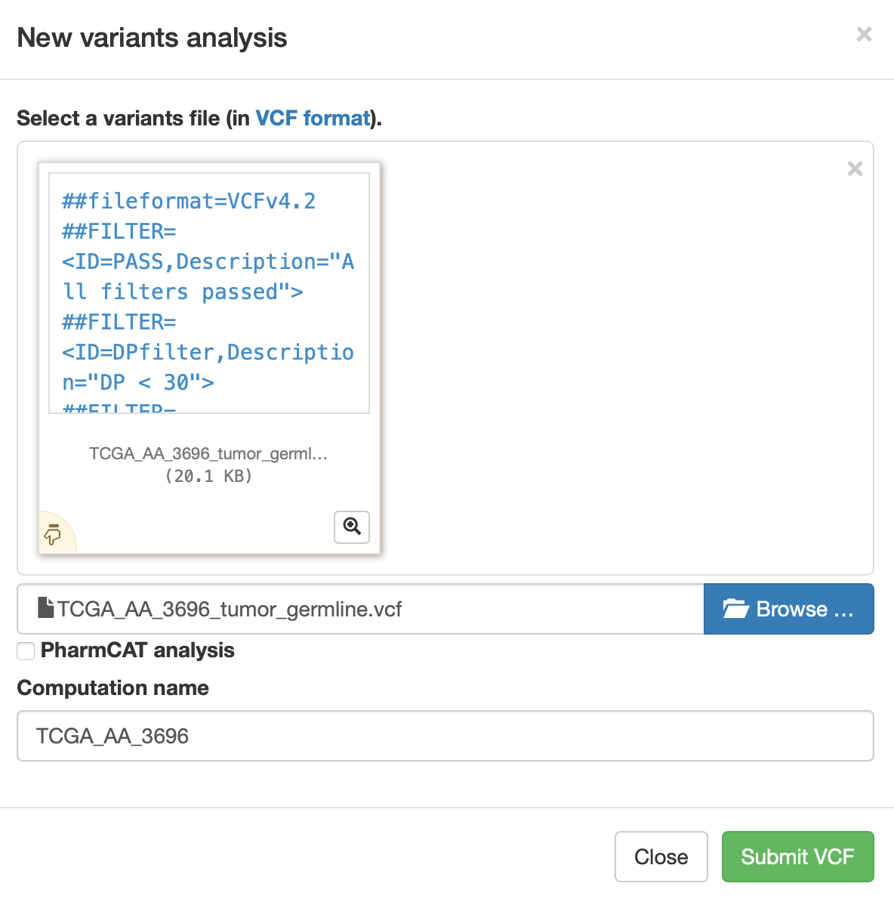

First, load the VCF, do not click on **PharmCAT analysis** and click on the **Submit VCF** button. 

If you come back to the small variants tab, you will notice a progress bar associated with your job. As the computation progresses, the completion of the different steps will be indicated in here. In this example, PanDrugs will annotate the somatic variants and compute GScores from VScores. For more details, please refer to the [Small Variants Query](#!/help#vcf-query) section.

When the progress bar is complete, **do not** modify any of the **Analysis Options** and click on the **Query with affected genes** button. Please note that at this point it is also possible to download a tab-delimited file with the annotations for each somatic variant and the corresponding VScore by clicking on **Download VScores**.

<u>**Output interpretation**</u>

In the results page, you will see a summary box with the execution details, some plots and a summary table with the drug ranking (see [Gene Names, Gene Ranking, CNVs, Small Variants and Multi-omics Query Output](#!/help#genes-gene-rank-cnvs-vcf-and-multi-omics-query-output) section for further details).

These results can be interpreted as the ones obtained after a [gene names analysis](#!/help#examples-genes-query), but keep in mind that these GScores also take into account the biological impact, the frequency and the clinical implications of the somatic variants in the VCF.

For this example, PanDrugs finds several Best Therapeutic Candidates . If you are interested in a drug repurposing approach using an hormone therapy, you may want to consider Tamoxifen (DScore = 0.9360; GScore = 0.6745), which is approved for breast cancer.

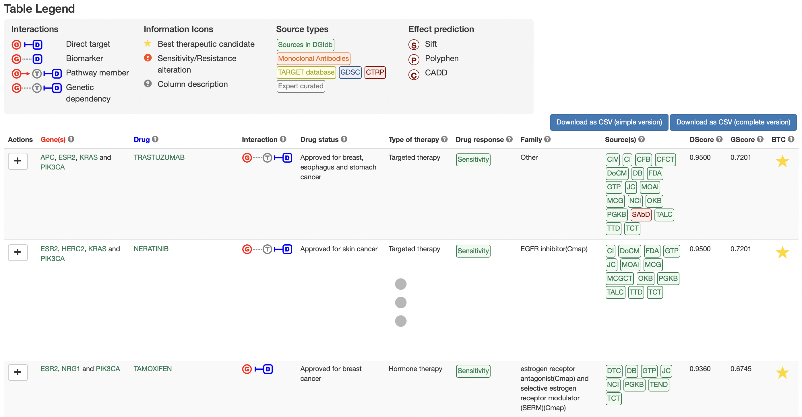

PanDrug's report with the BTCs is available at the top of the page.

#### 6.5.2.1 Small Variants Analysis with PharmCAT

Let's enrich the output of the [Small Variants Analysis without PharmCAT](#!/help#examples-vcf-query-no-pharmcat) with CPIC recommendations. [Load example for a colon adenocarcinoma patient from the TCGA with synthetic germline variants.](#!/query?tab=vcfrank)

Again, load the VCF, but this time click on **PharmCAT analysis**, load the example .tsv with the *CYP2D6* genotype called outside PharmCAT and click on the **Submit VCF** button. 

PanDrugs will annotate the somatic variants and compute GScores from VScores. In addition, PanDrugs will query PharmCAT with the germline variants in order to retrieve the CPIC recommendations for the drugs shown in the final ranking. For more details, please refer to the [Small Variants Query](#!/help#vcf-query) section.

When the progress bar is complete, **do not** modify any of the **Analysis Options** and click on the **Query with affected genes** button. Please note that at this point it is also possible to download a tab-delimited file with the annotations for each somatic variant and the corresponding VScore by clicking on **Download VScores**. Moreover, you can download PharmCAT's report by clicking on **PharmCAT report**.

<u>**Output interpretation**</u>

The results page will look exactly the same as the the output of the [Small Variants Analysis without PharmCAT](#!/help#examples-vcf-query-no-pharmcat). However, the summary table will show an additional column named **PharmCAT**.

Please, take a look at tamoxifen entry. There is a PharmCAT label that indicates that this patient has germline variants that are associated with Adverse Drug Reactions (ADRs) to this drug. If you click on the icon, you will be redirected to tamoxifen's section in PharmCAT's report, which further explains the administration guideline.

<!--
If you look for Fluorouracil (DScore = 0.8110; GScore = 0.4710) you will see a PharmCAT label that indicates that this patient has germline variants that are associated with Adverse Drug Reactions to this drug. If you click on the icon, you will be redirected to this Fluorouracil's section in PharmCAT's report, which further explains the administration recommendation.
-->
 

Moreover, the full PharmCAT's report can be downloaded from the summary box at the top of the page. PanDrug's report with the BTCs is available at the top of the page.

### 6.6. Multi-omics Analysis

For this example, we are using small variant, CNV and expression data from patient [TCGA-D8-A1JD](https://www.cbioportal.org/patient?studyId=brca_tcga_pan_can_atlas_2018&caseId=TCGA-D8-A1JD). This patient harbours mutations in *PIK3CA* and a deletion in *BRCA2* that leads to the decreased expression of this gene. 

We have already analyzed data from this patient in the [CNVs Analysis](#!/help#examples-cnvs-query) and the [Small Variants Analysis](#!/help#examples-vcf-query) sections. In the following example, we will show how PanDrugs' results can be expanded using different omics data from the same patient.

#### 6.6.1 Multi-omics Analysis without VCF

[Load example for a breast invasive ductal carcinoma patient from the TCGA.](#!/query?tab=multiomics)

First, upload both the example CNV .tsv and expression .rnk files. **Do not** click on **With variant analysis**, **do not** modify any of the **Analysis Options** and click on the **Query** button.

<u>**Output Interpretation**</u>

On the results page, you will see a summary box with the execution details, some plots and a summary table with the drug ranking (see [Gene Names, Gene Ranking, CNVs, Small Variants and Multi-omics Query Output](#!/help#genes-gene-rank-cnvs-vcf-and-multi-omics-query-output) section for further details).

These results can be interpreted as the ones obtained after a [gene names analysis](#!/help#examples-genes-query).

PanDrugs finds several BTCs  based on CNV and expression evidence. 

Please, order the summary table by descending GScore to visualize the results. You will notice that everolimus is the drug with the highest combined DScore and GScore (DScore = 0.8220; GScore = 0.7338).

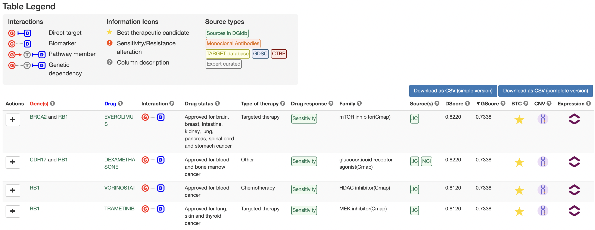

If we expand everolimus row by clicking on the , we will get further information about the type of gene alterations that are contributing to PanDrugs ranking. In the expanded table, we observe that both *RB1* and *BRCA2*, biomarkers of everolimus, are deleted and this deletion leads to gene underexpression.

#### 6.6.2 Multi-omics Analysis with VCF

[Load example for a breast invasive ductal carcinoma patient from the TCGA.](#!/query?tab=multiomics)

The VCF contains the patient's somatic variants without any germline alteration, so we cannot select **PharmCAT analysis**.

**Important: If you are logged in**, you will be able to select any of the VCFs that you have previously annotated. These **annotations are stored** in your account **for up to 6 months**, so they can be queried many times. **If you are a guest user**, you can do this type of analysis **right after a [small variants query](#!/help#vcf-query) with the VCF** of interest.

For the sake of this example, we will run this analysis from scratch.

First, go to the small variants query tab and load the VCF as indicated in the section [Small Variants Analysis without PharmCAT](#!/help#examples-vcf-query-no-pharmcat). Please, **do not** click on **PharmCAT analysis**.

<!-- Update image -->

Once the progress bar is complete, return to the multi-omics query tab.

Then, click on **With variant analysis** and select the VCF you just annotated from the list. Also, upload both the example CNV .tsv and expression .rnk files. Keep in mind that you can choose just one of them, but we want to show you what a complete multi-omics analysis looks like.

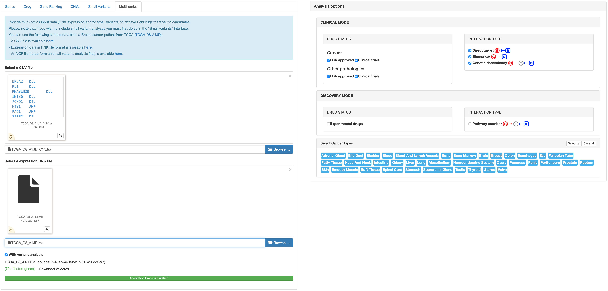

Finally, **do not** modify any of the **Analysis Options** and click on the **Query** button.

<u>**Output Interpretation**</u>

On the results page, you will see a summary box with the execution details, some plots and a summary table with the drug ranking (see [Gene Names, Gene Ranking, CNVs, Small Variants and Multi-omics Query Output](#!/help#genes-gene-rank-cnvs-vcf-and-multi-omics-query-output) section for further details).

These results can be interpreted as the ones obtained after a [gene names analysis](#!/help#examples-genes-query), but keep in mind that the GScores have been computed in two ways:

- For the genes in the CNV file, the GScores are the pre-computed ones. These scores have been calculated according to gene essentiality, tumor vulnerability, relevance of the gene in cancer and its druggability level.

- For the somatic variants found in the VCF, the GScores also take into account the biological impact, the frequency and the clinical implications of these variants.

If a gene has small variants and CNVs, the GScore computed from VScores has priority over the other GScore.

PanDrugs finds several BTCs  based on small variant, CNV and expression evidences. Afatinib is the drug with highest combined DScore and GScore (DScore = 0.9280; GScore = 0.7995) according to the 3 evidence sources.

If we expand afatinib row by clicking on the , we will get further information about the type of gene alterations that are contributing to PanDrugs ranking:

  - A mutation in *PIK3CA* leads to high overexpression of this gene.
  - An amplification in *JPH1* also leads to high overexpression of this gene.

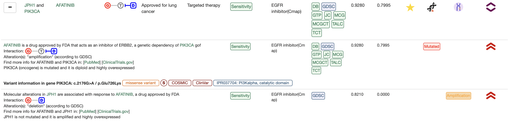

If we search for everolimus, we will notice that its entry is not at the top of the list. Indeed, there are a handfull of drugs that appear before everolimus because we included the patient's somatic variants and *PIK3CA* mutation drives higher GScores and DScores. This results, when compared to the ones obtained without a VCF, highlight the advantages of a full combined multi-omics analysis.

PanDrug's report with the BTCs is available at the top of the page.