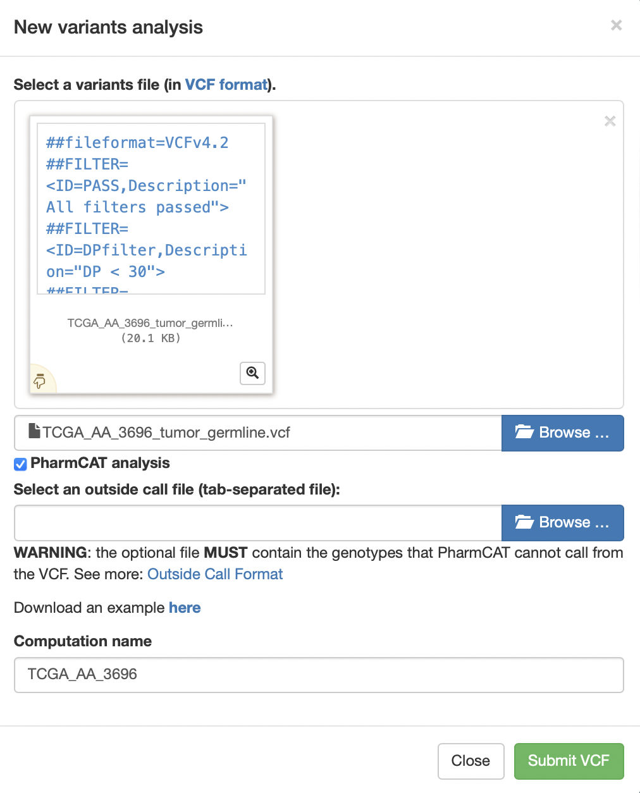

# PanDrugs Help

1. [QUERY OPTIONS](#/help#query-options)
  1. [Genes query](#/help#genes-query)
  2. [Gene ranking query](#/help#gene-ranking-query)
  3. [Drugs query](#/help#drugs-query)
  4. [VCF (Genomic Variant)](#/help#vcf)

2. [ADVANCED OPTIONS](#/help#advanced-options)
  1. [Drug status level](#/help#drugs-status-level)
  2. [Interaction evidence level](#/help#interaction-evidence-level)
  3. [Select cancer type](#/help#select-cancer-type)

3. [OUTPUT FOR GENES, GENE RANK AND VCF (GENOMIC VARIANTS)](#/help#output-for-genes-gene-rank-and-vcf)
  1. [Charts](#/help#drugs-status-level)
    1. [Plot-chart](#/help#plot-chart)
    2. [Pie-charts](#/help#pie-charts)
  2. [Summary table](#/help#summary-table)

4. [OUTPUT FOR DRUGS QUERY](#/help#output-for-drugs-query)
  1. [GScore AND DScore CONCEPT AND CALCULATION](#/help#gscore-and-dscore-concept-and-calculation)

5. [EXAMPLES](#/help#examples)
  1. [Genes query](#/help#examples-genes-query)
  2. [Gene ranking query](#/help#examples-gene-ranking-query)
  3. [Drugs query](#/help#examples-drugs-query)
  4. [VCF (Genomic Variant)](#/help#examples-vcf)

6. [DATABASE VERSIONS FOR VCF ANNOTATION](#/help#database-versions-for-vcf-annotation)

## 1. Query Options
There are three possible input options to obtain a **list of therapies according to an individualized genetic profile**:

- A list of gene symbols.
- A ranked list of gene symbols.
- A vcf file containing a set of variants corresponding to the GRCh37/HG19 assembly of the human genome.

Another possibility is to query the database to see **which genes are associated in the database with a particular drug**.

### 1.1 Genes query
In this modality, the input is a **set of genes that must be introduced with the corresponding Gene Symbol**. Each gene name must be in a different line.

Based on this gene list, the potential therapies are calculated taking into account the global set of genes. That is, if there are predicted resistance responses to a drug based on a particular gene, although another gene indicates sensitivity, that drug will be kept down in the list (in the resistance region).

### 1.2 Gene ranking query
In this search option, it is possible to provide a **ranked list of genes in the RNK (Ranked List) file format**.

This file must be uploaded and must contain an ordered gene list with two tab delimited columns. In the first column we have the HUGO Gene Symbols and the second column contains the corresponding weight. This weight will be normalized to a range between 0-1.

### 1.3 Drugs query
In this query option, **a particular drug** can be selected in order to explore the connection of the compound with the genes in the database. Drugs can be searched in the database by the source name, the standardized drug name or the preferred shown name. When typing the name, the suggestions for the drug are shown.

### 1.4 VCF
In this search option, a **vcf file** must be provided. In this file, the genomic coordinates must be expressed in the HG19 assembly of the human genome.

To create a new analysis click on New variants analysis... button, select a vcf file, select a name for the job and click on Submit VCF file button.

A message indicating that computations has been successfully submitted appears and a new analysis with an associated progress bar appears in the variant analysis box.

As the computation progress, the completion of the different steps is indicated in the progress bar.

During this process, the VCF file is annotated using the Variant effect Predictor of ensembl and additional databases. A variant score is the computed for each variant and a set of genes with relevant consequences and the highest variant score is created. This highest variant score is the final GScore.

Finally, when the job is entirely done, it can be selected in order to query PanDrugs database and retrieve the suggest treatments according to the provided profile.

## 2. Advanced Options
