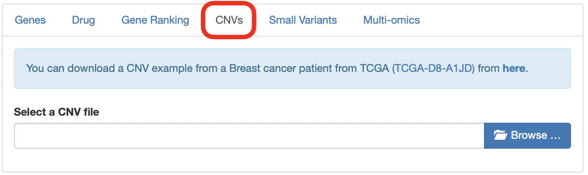
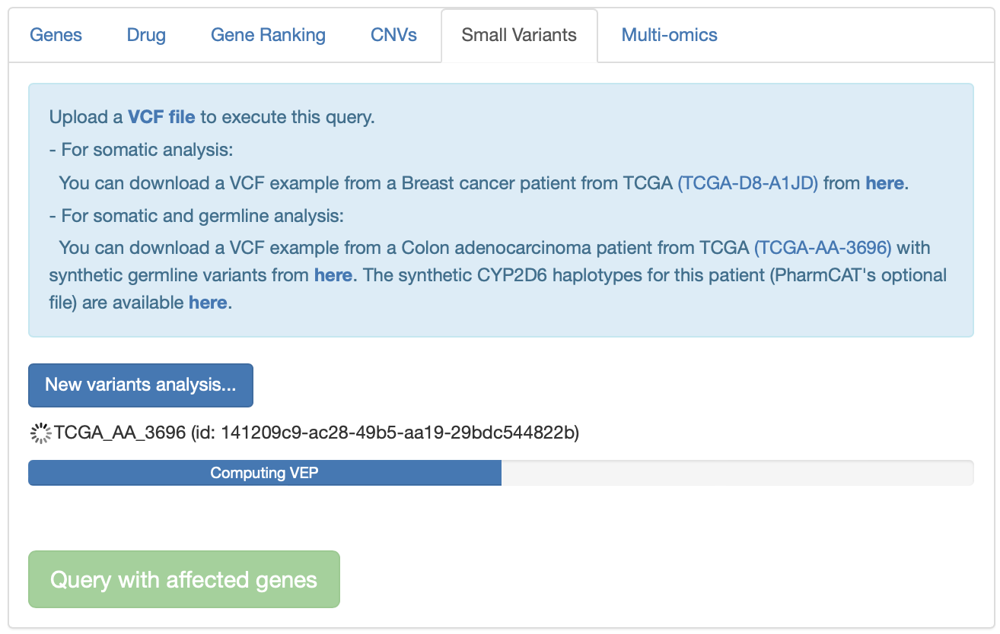
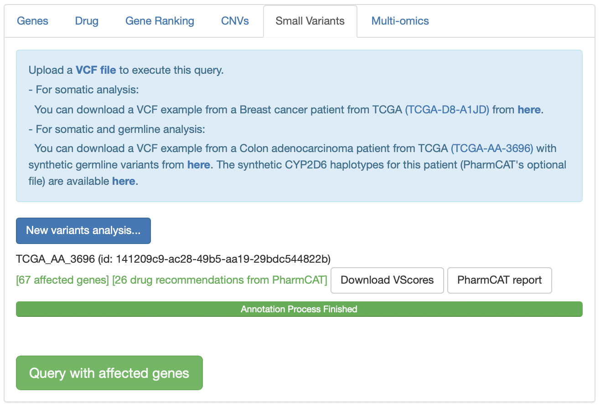
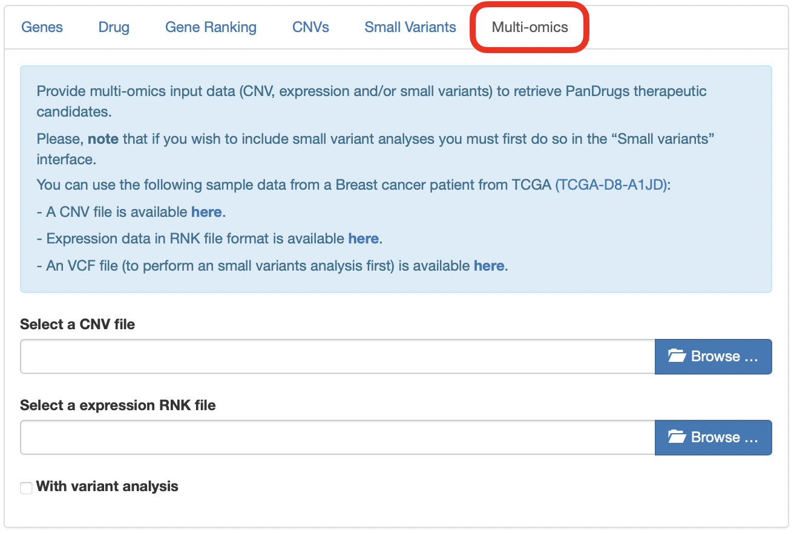
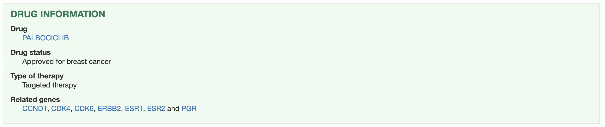
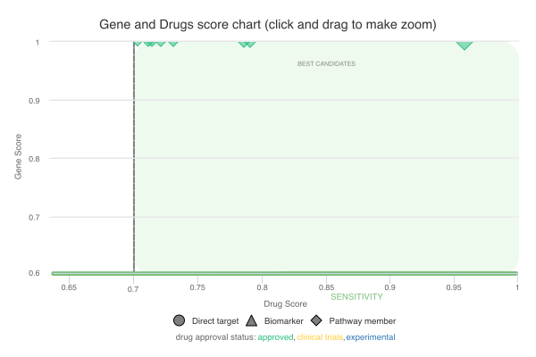
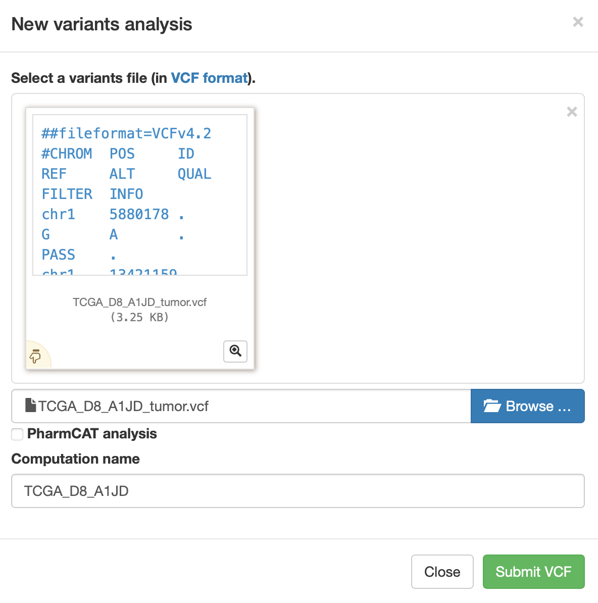
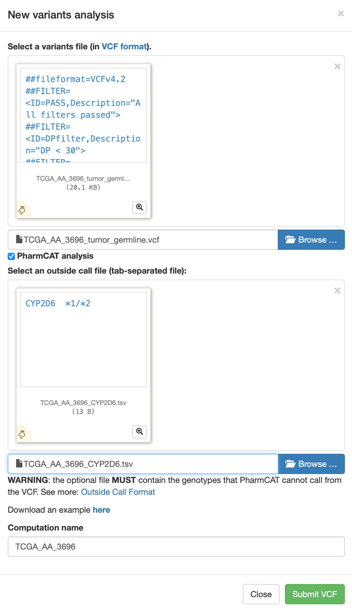
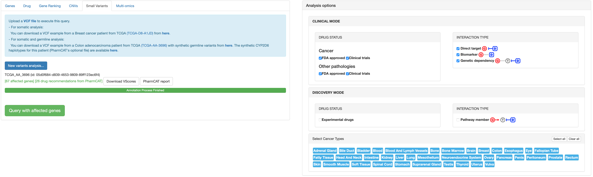
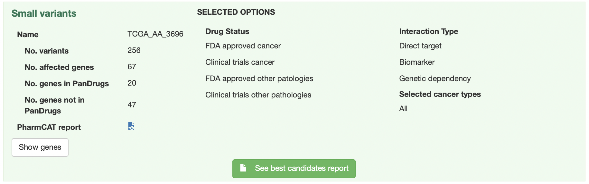

# PanDrugs Help

1. **[Query Options](#!/help#query-options)**
  1. [Genes Query](#!/help#genes-query)
  2. [Gene Ranking Query](#!/help#gene-ranking-query)
  3. [Drug Query](#!/help#drug-query)
  4. [CNVs Query](#!/help#cnvs-query)
  5. [Small Variants Query](#!/help#vcf-query)
  6. [Multi-omics Query](#!/help#multi-omics-query)

2. **[Advanced Options](#!/help#advanced-options)**
  1. [Drug Status Level](#!/help#drugs-status-level)
  2. [Interaction Evidence Level](#!/help#interaction-evidence-level)
  3. [Select Cancer Types](#!/help#select-cancer-types)

3. **[PanDrugs Scores](#!/help#pandrugs-scores)**
  1. [DScore Calculation](#!/help#dscore-calculation)
  2. [GScore Calculation](#!/help#gscore-calculation)

4. **[Genes, Gene Ranking, CNVs, Small Variants and Multi-omics Query Output](#!/help#genes-gene-rank-cnvs-vcf-and-multi-omics-query-output)**
  1. [Summary Box](#!/help#summary-box)
  2. [Charts](#!/help#drug-status-level)
    1. [Scatter Plot](#!/help#scatter-plot)
    2. [Pie Charts](#!/help#pie-charts)
  3. [Summary Table](#!/help#summary-table)

5. **[Drug Query Output](#!/help#drug-query-output)**

6. **[Examples](#!/help#examples)**
  1. [Genes Analysis](#!/help#examples-genes-query)
  2. [Gene Ranking Analysis](#!/help#examples-gene-ranking-query)
  3. [Drug Analysis](#!/help#examples-drug-query)
  4. [CNVs Analysis](#!/help#examples-cnvs-query)
  5. [Small Variants Analysis](#!/help#examples-vcf-query)
    1. [Small Variants Analysis with Somatic Alterations](#!/help#examples-vcf-query-somatic-variants)
    2. [Small Variants Analysis with Somatic and Germline Alterations](#!/help#examples-vcf-query-somatic-germline-variants)
      1. [Small Variants Analysis without PharmCAT](#!/help#examples-vcf-query-no-pharmcat)
      2. [Small Variants Analysis with PharmCAT](#!/help#examples-vcf-query-pharmcat)
  6. [Multi-omics Analysis](#!/help#examples-multi-omics-query)
    1. [Multi-omics Analysis without VCF](#!/help#examples-multi-omics-query-wo-vcf)
    2. [Multi-omics Analysis with VCF](#!/help#examples-multi-omics-query-w-vcf)

<!--
7. [DATABASE VERSIONS FOR VCF ANNOTATION](#!/help#database-versions-for-vcf-annotation)
-->

## 1. Query Options
There are five possible input options to obtain a **rank of therapies according to an individualized genetic profile**:

  - A list of gene symbols ([Genes Query](#!/help#genes-query)).
  - A ranked list of gene symbols ([Gene Ranking Query](#!/help#gene-ranking-query)).
  - A list of gene symbols and their CNV status ([CNVs Query](#!/help#gene-ranking-query)).
  - A VCF file containing a set of somatic (and optionally germline) variants <!-- corresponding to the GRCh38/hg38 assembly of the human genome -->([Small Variants Query](#!/help#vcf-query)).
  - At least two of these inputs in order to make a [Multi-omics Query](#!/help#multi-omics-query):

    - A CNVs Query.
    - A Small Variants Query.
    - A list of genes ranked according to their expression change between tumor and normal samples.

Another possibility is to query the database to see **which genes are associated with a particular drug**.

### 1.1 Genes Query
In this modality, the input is a **set of gene symbols** that can be pasted directly in the text box or uploaded as a file **without header**. **In both cases, each gene symbol must appear in a different line**.

### 1.2 Gene Ranking Query
In this query option, it is possible to upload a **ranked list of genes as a [RNK file](https://software.broadinstitute.org/cancer/software/gsea/wiki/index.php/Data_formats#RNK:_Ranked_list_file_format_.28.2A.rnk.29)**.

This file must consist in two tab delimited columns containing gene symbols and the ranking metric, respectively. Each gene symbol must appear in a different line. 

The ranking metric will be scaled between 0 and 1 and will be treated as an user-supplied [GScore](#!/help#gscore-calculation), overwritting the pre-computed one.

### 1.3 Drug Query
**A single drug** can be queried in order to explore its connection with the genes in the database. PanDrugsdb contains information about drug synonyms. So, as you type a drug name, several suggestions matching your query will appear.

### 1.4 CNVs Query
In this modality, you can upload a **tab delimited file without headers** formed by two columns. The first one must contain a **gene symbol** per line. The second column must indicate the **CNV status** of the correspondind gene (either "AMP" for amplification or "DEL" for deletion). **Diploid genes must not be listed in this file**.

### 1.5 Small Variants Query
In this query option, you must upload a **[VCF](https://samtools.github.io/hts-specs/VCFv4.2.pdf)** containing somatic and, optionally, germline variants. <!-- The genomic coordinates in this VCF must correspond to the GRCh38/hg38 assembly of the human genome. -->

**If the input VCF contains germline variants, there is an option to run [PharmCAT](https://pharmcat.org) and include the [Clinical Pharmacogenetics Implementation Consortium (CPIC)](https://cpicpgx.org) drug recommendations in the final ranking returned by PanDrugs**. In order to do so, the **input VCF must contain genotype data with one or two sample columns**. These are the two accepted formats:

- **Ideally**, a VCF with **two sample columns named "tumor" and "normal"** detailing the genotypes of the corresponding variant in each sample. Please note that, while the order of the sample columns is indifferent, **the names must be strictly "tumor" and "normal"**.
- A VCF with a **single sample column** containing somatic and germline variants all together. In this case, **there are not requirements regarding the name of the sample column**.

To create a new analysis, click on **New variants analysis...** and then select a valid VCF file. You can click on **PharmCAT analysis** and optionally upload a TSV file with genotypes called outside PharmCAT. Moreover, you can provide a meaningful name for the job. Finally, click on **Submit VCF**.

A message indicating that the computation has been successfully submitted will appear. In this message you will get a link in order to follow the computation progress.

Moreover, if you come back to the **Small Variants** tab or follow the link, you will notice a progress bar associated to your job. As the computation progresses, the completion of the different steps will be indicated in this progress bar.

During this process, the somatic variants included in the VCF are annotated using Ensembl's [Variant Effect Predictor (VEP)](https://www.ensembl.org/info/docs/tools/vep/index.html) and additional databases. With these annotations, a Variant Score (VScore) is computed for each variant. The final GScore is then calculated as the maximum VScore for the principal transcript of each gene.

If you clicked on **PharmCAT analysis**, the germline variants will be used to query PharmCAT in order to retrieve the CPIC recommendations.

Finally, when the progress bar is complete, you can query PanDrugsdb and obtain a ranking of treatments **tailored to the provided genomics profile**. If you clicked on **PharmCAT analysis**, PanDrugs output will contain CPIC recommendations (if any) for the ranked drugs and a link to PharmCAT's report.

Moreover, it is possible to download a tab delimited file with the annotations for each somatic variant and the corresponding VScore by clicking on **Download VScores** or the PharmCAT report by clicking on **PharmCAT report**.

If you are logged in PanDrugs, the results of the query will be stored in your personal account. You will be able to access any previous analyses done within the last 6 months and select one of them to make a new query. You can register [here](https://pandrugs.sing-group.org/#!/login). **Note that the germline variants used to query PharmCAT are deleted immediately and are not stored in our servers**.

### 1.6 Multi-omics Query
You can perform a Multi-omics Query in case you have at least two of these inputs for the same patient:

  - Expression data
  - CNV information
  - A VCF

In this query option, the expression data can be uploaded as a **[RNK file](https://software.broadinstitute.org/cancer/software/gsea/wiki/index.php/Data_formats#RNK:_Ranked_list_file_format_.28.2A.rnk.29)**.

This file must consist in two tab delimited columns containing gene symbols and the ranking metric, respectively. Each gene symbol must appear in a different line and **the ranking metric must reflect the expression change between tumor and normal samples** (e.g. a differential expression test statistic).

The files containing CNV information and the VCF must be as detailed in sections [CNVs Query](#!/help#cnvs-query) and [Small Variants Query](#!/help#vcf-query), respectively.

If expression data is available, PanDrugs will compute the 90th percentile of the expression metric and will assign an expression label to each gene in the RNK file:

- **Highly Overexpressed<!--Oncogenes-->:** <!--Oncogenes-->Genes with an expression metric above the 90th percentile.
- **Overexpressed:** Genes with an expression metric > 0.
- **Underexpressed:** Genes with an expression metric < 0.
- **Not Expressed:** Genes with no expression information (i.e. genes that appear in any other input).

Then, PanDrugs will query its database with the Highly Overexpressed <!--Oncogenes-->Genes and/or the genes with known CNV status information, if available. Moreover, if there is a VCF, PanDrugs runs an additional analysis as [detailed before](#!/help#vcf-query).

PanDrugs output will rank all drugs associated with either the Highly Overexpressed <!--Oncogenes-->Genes, the genes with known CNV status or the genes with somatic alterations. If you clicked on **PharmCAT analysis**, PanDrugs output will contain CPIC recommendations (if any) for the ranked drugs and a link to PharmCAT's report.

## 2. Advanced Options

Those queries based on genes ([Genes](#!/help#genes-query), [Gene Ranking](#!/help#gene-ranking-query), [CNVs](#!/help#cnvs-query) and [Small Variants](#!/help#vcf-query)) can be adjusted using the panel of Advanced Options:

### 2.1 Drug Status Level

Allows to filter therapeutic options according to their approval status for cancer or other pathologies. The options are:

**Cancer:**

- **FDA approved:** FDA approved drugs for cancer treatment.
- **Clinical trials:** Drugs in clinical trials for cancer treatment.

**Other pathologies:**

- **FDA approved:** FDA approved drugs for other conditions or pathologies.
- **Clinical trials:** Drugs in clinical trials for the treatment of other conditions or pathologies.
- **Experimental:** Compounds in pre-clinical phase.

By default, all options are selected so the results include drugs in all the approval status levels.

### 2.2 Interaction Evidence Level

Allows to filter therapeutic options according to the type of drug-gene interaction:

- **Direct target :** Show drugs that directly target any input gene that contributes to a disease phenotype.

- **Biomarker :** Show drugs whose response is associated, based on clinical or pre-clinical evidences, with the genetic status of any input gene.

- **Pathway member :** Show drugs that target any downstream druggable genes within the pathway of the input genes.

<!-- - **Gene dependency**: Show drugs that target any gene with a genetic dependency on the input genes. -->

By default, all options are selected so the results include all types of drug-gene interactions.

### 2.3 Select Cancer Types

Allows to filter therapeutic options **approved for specific cancer types**. **Drugs in clinical trials or experimental drugs associated to the input genes will be shown independently of this filter**. If you want your output to only contain approved drugs for the selected cancer types, **you must also filter by FDA approved drugs for cancer** (see [Drug Status Level](#!/help#drugs-status-level) section).

By default, all cancer types are selected.

## 3. PanDrugs Scores

PanDrugs **ranks the results based on** two scores: the **Drug Score (DScore)** and the **Gene Score (GScore)**.

- The **DScore** measures the **suitability of the treatment** according to the drug indication and status, type of drug-gene association and curation level of the sources. It **ranges from -1 to 1**, with the negative values corresponding to resistance and the positive values corresponding to sensitivity.

- The **GScore** measures the **biological relevance of a gene in the tumoral process and its druggability**. It is estimated according to gene essentiality, tumor vulnerability, relevance of the gene in cancer, its druggability level, the biological impact of mutations, the frequency of gene alterations and their clinical implications. The GScore **ranges from 0 to 1**.

### 3.1 DScore Calculation

PanDrugsdb stores pre-computed DScores for each drug. This score has been calculated according to the drug indication and approval status, type of drug-gene interaction and drug response.
<!--
-->

Depending on the type of query, the DScore can suffer modifications:
  
  - **After a Drug Query:** The table shows the pre-computed DScore.

  - **After any other query:** The table shows a final DScore for each individual drug. PanDrugs selects the maximum pre-computed DScore in absolute value, multiplied by its original sign, among all drug-gene associations for a specific drug. Then, it modifies this score to account for the approval status of the drug, number of associated genes, their interactions with the drug and curation level of the sources.
  <!--
-->

### 3.2 GScore Calculation

PanDrugsdb stores pre-computed GScores for each gene symbol. This score has been calculated according to gene essentiality, tumor vulnerability, relevance of the gene in cancer and its druggability level.

Depending on the type of query, the GScore can suffer modifications:
  
  - **After a Drug Query:** The table shows the pre-computed GScore.

  - **After a Genes or CNVs Query:** The table shows a final GScore for each group of genes. PanDrugs selects the maximum pre-computed GScore among all drug-gene associations for a specific drug.

  - **After a Gene Ranking Query:** The GScore is computed by scaling the ranking metric in the second column between 0 and 1.

  - **After a Small Variants Query:** A Variant Score (VScore) is computed for each variant taking into account their biological impact, their frequency and their clinical implications. The final GScore is then calculated as the maximum VScore for the principal isoform of each gene.

  - **After a Multi-omics Query:** There can be two types of GScores:

    - **For the genes in the VCF:** The GScores are computed from VScores as in a Small Variants Query.
    - **For the genes in the CNV file and/or the expression RNK:** The final GScore for the genes with CNVs and/or the Highly Overexpressed <!--Oncogenes-->Genes is computed as in a CNVs Query.

    If a gene is found in the VCF and any other input file, the GScore computed from VScores has priority over the other GScore.

## 4. Genes, Gene Ranking, CNVs, Small Variants and Multi-omics Query Output

Once the query has been completed, a summary box with the execution details, some plots and a summary table with a drug ranking will appear.

### 4.1 Summary Box

This box details the total number of queried genes as well as the number of genes present and absent in PanDrugsdb. Morever, it specifies the type of query in the title and the [Advanced Options](#!/help#advanced-options) that were selected. If you made a [Small Variants Query](#!/help#vcf-query) with **PharmCAT analysis**, the full PharmCAT's report will be available for download at the summary box.

### 4.2 Charts

#### 4.2.1 Scatter Plot

In this plot, the x and y axes represent the DScore and GScore for each drug, respectively. Positive values of the x axis correspond to sensitivity assignations and negative values represent resistance associations.

The ranked therapies are plotted as points with different shapes, colors and sizes:

- **Shape** indicates the type of drug-gene association.
- **Color** indicates the approval status of the drug.
- **Size** is proportional to the final GScore/DScore ratio.

Moreover, we define two thresholds: DScore = 0.7 and GScore = 0.6 to divide the scatter plot into quadrants. The area above both thresholds is shaded in green and includes the drugs labelled as **Best Therapeutic Candidates (BTC)**.

You can click and drag the cursor to select any plot region you want to zoom in. In addition, the scatter plot can be printed or downloaded in different formats (PNG, JPEG, PDF or SVG) by clicking on this icon: .

#### 4.2.2 Pie Charts

**Drugs by approval status**

This chart shows the percentage of ranked therapies in each approval status group (Approved, Clinical Trials or Experimental).

**Drugs by family**

This chart shows the percentage of ranked therapies that belongs to each drug family.

These two charts can also be printed or downloaded in different formats (PNG, JPEG, PDF or SVG) by clicking on this icon: .

### 4.3 Summary Table

The summary table shows the therapeutic options returned by PanDrugs ranked first by DScore and then by GScore. This table has the following columns:

**1. Gene(s):** Queried genes that have an association with the corresponding drug in PanDrugsdb. Each gene symbol is linked to its page at the [NCBI](https://www.ncbi.nlm.nih.gov/gene).

**2. Drug:** Compound's name. Each drug is linked to its page in [PubChem](https://pubchem.ncbi.nlm.nih.gov).

**3. Interaction:** Drug-gene relationship between the genes and the drug. The value of this column in the collapsed table corresponds to the drug-gene pair with the highest DScore and GScore. Options are:

  - **Direct:** The altered gene is the target or the biomarker of the drug.

    - **Direct target **
    - **Biomarker **

  - **Indirect:** The drug's target is a gene related to the altered one.

    - **Pathway member**
    <!-- - Genetic dependency  -->

**4. Drug status:** Approval status and cancer prescription for the approved drugs.

**5. Type of therapy:** Only available for drugs approved for cancer treatment. Options are:

  - **Targeted therapy:** Drugs that specifically attack cancer cells.
  - **Chemotherapy:** Drugs that kill fast-growing cells.
  - **Immunotherapy:** Drugs that boost or change how the immune system works in order to fight against cancer.
  - **Hormone therapy:** Suppression of certain hormones that can prompt or help in the tumor growth.
  - **Photodynamic therapy:** Use of light-sensitive drugs, called photosensitizing agents, along with light to kill cancer cells.

**6. Drug response:**  or  response, based on the gene alteration. Alerts are included in this area:

  -  If there is a predicted **resistance** response to a drug based on a particular gene and another gene indicates **sensitivity**, that drug will be assigned the label **both** in the Drug response column. These indications should be reviewed to decide drug's suitability for a particular case, as sometimes the **sensitivity** or **resistance** response is dependent on a particular type of alteration. 
  -  Sometimes, an exclamation mark appears as a warning, indicating that some information based on expert knowledge has to be taken into account.

**7. Family:** Drug family to which the compound belongs to. It is based on the [KEGG's Target-based Classification of Drugs](https://www.genome.jp/kegg-bin/get_htext?br08310.keg) and the [Connectivity Map (CMAP)](https://www.broadinstitute.org/connectivity-map-cmap) classification.

**8. Source(s):** Source(s) where the drug-gene interaction comes from. Each source name links to the original resource. Sources are:

  

**9. DScore:** Measures the suitability of the treatment. It ranges from -1 to 1, with the negative values corresponding to resistance and the positive values corresponding to sensitivity. For further information, please refer to [DScore Calculation](#!/help#dscore-calculation) section.

**10. GScore:** Measures the biological relevance of the gene in the tumoral process and its druggability. It ranges from 0 to 1. For further information, please refer to [GScore Calculation](#!/help#gscore-calculation) section.

**11. BTC:** The Best Therapeutic Candidates, with DScore > 0.7 and GScore > 0.6, are highlighted with a yellow star  in the BTC column.
  
**12. PharmCAT:** This column will appear after a [Small Variants Query](#!/help#vcf-query) or a [Multi-omics Query](#!/help#multi-omics-query) with **PharmCAT analysis**. The drugs with CPIC recommendations will be labelled with one of these icons:

  -  **Strongly Recommended:** There is **strong** evidence to **recommend** the administration of this drug according to patient's germline variants.
  -  **Moderately Recommended:** There is **moderate** evidence to **recommend** the administration of this drug according to patient's germline variants.
  -  **Warning:** There are **several recommendations** for the same drug-variant association. These indications should be reviewed to decide which recommendation to follow based on the patient's population. 
  -  **Moderately not Recommended:** There is **moderate** evidence to **not recommend** the administration of this drug according to patient's germline variants.
  -  **Strongly not Recommended:** There is **strong** evidence to **not recommend** the administration of this drug according to patient's germline variants.

  All these icons are linked to the corresponding drug section in PharmCAT's report, which further explains the administration recommendation. The full PharmCAT's report can be downloaded from the [summary box](#!/help#summary-box).

**13. SNV:** This column will appear after a [Multi-omics Query](#!/help#multi-omics-query) with a VCF. A drug will be labelled with this icon  when any of its associated genes presents a somatic variant.

**14. CNV:** This column will appear after a [Multi-omics Query](#!/help#multi-omics-query) with a CNV file or a [CNVs Query](#!/help#cnvs-query). A drug will be labelled with this icon  when any of its associated genes presents a CNV (either an <!--Amplification--> or <!--Deletion-->).

**15. Expression:** This column will appear after a [Multi-omics Query](#!/help#multi-omics-query) with expression data. A drug will be labelled with this icon  when any of its associated genes is labelled as

  -  Highly Overexpressed <!--Oncogene-->Gene
  -  Overexpressed
  -  Underexpressed

Each row has **ADDITIONAL INFORMATION** that can be expanded clicking on the  button. Columns 6, 8 to 10 and 13 to 15 are further detailed for each gene involved in the drug assignation. Moreover, a new section for each gene is shown on the left. This section contains:

  - A sentence explaining the association between the drug and the gene.

  - The type of drug-gene ineraction for that gene. When this interaction is of type pathway member , there is a button that shows a pop-up with a summary of the KEGG pathways the gene is involved in. Each pathway name has a link to a KEGG's visualization with the affected and targeted genes highlighted.

  - The type of alteration that drives the **sensitivity**/**resistance**/**both** drug response.

  - A link to [PubMed](https://pubmed.ncbi.nlm.nih.gov) and [ClinicalTrials.gov](https://clinicaltrials.gov/ct2/home) with additional information regarding the drug-gene association.

  - **After a query with a VCF (either a [Small Variants](#!/help#vcf-query) or [Multi-omics Query](#!/help#multi-omics-query)):** Annotations for the variant affecting the gene are provided.

  - **After a [Multi-omics Query](#!/help#multi-omics-query):** A sentence explaning the coherence between the alterations found in the different input files is provided.

## 5. Drug Query Output

After doing a [Drug Query](#!/help#drug-query) to retrieve the genes associated with a particular drug, the result consists in a summary box and a summary table similar to the one returned by other types of queries.

In this case, the summary box details the genes associated with the input drug according to PanDrugsdb. Morever, it specifies the drug status and type of therapy.

In the [summary table](#!/help#summary-table), each row represents a gene associated with the input drug. The reported DScore and GScore are the pre-calculated ones for each drug-gene interaction in the database.

## 6. Examples

### 6.1. Genes Analysis

Load **Example 3** from [Genes Query tab](#!/query?tab=genes).

This list contains the genes involved in the PI3K-AKT-mTOR signaling pathway, which plays an important role in proliferation.

Do not modify any of the **Advanced Options** and click on the **Query** button.

<u>**Output Interpretation**</u>

In the results page, you will see a summary box with the execution details, some plots and a summary table with the drug ranking (see [Genes, Gene Ranking, CNVs, Small Variants and Multi-omics Query Output](#!/help#genes-gene-rank-cnvs-vcf-and-multi-omics-query-output) section for further details).

Among the Best Therapeutic Candidates , PanDrugs suggests Temsirolimus and Alpelisib.

If you take a look to the summary table, you will see that these two drugs have the highest DScore and GScore in the ranking. Also, they have multiple associations with several input genes, being the one with the highest DScore and GScore:

- A pathway member  for Temsirolimus
- A direct target  for Alpelisib

Moreover, Temsirolimus and Alpelisib are both targeted therapies approved for cancer and belong to the mTOR inhibitor and PI3K inhibitor families respectively.

If you expand Temsirolimus row by clicking on the  button you will notice that this drug suggestion is based on:

1. A pathway member association with *AKT1*, *AKT2*, *PDPK1*, *PIK3CA*, *PIK3R1*, *PIK3R2*, *RHEB*, *TSC1* and *TSC2*, which are downstream *MTOR*. You can click on **See pathways** to retrieve more information regarding the functional pathways in which they are involved.
2. A direct target inhibition: *MTOR*.
3. Two response biomarkers: *PIK3CA* and *PTEN*.

You may also notice one alert  in the **Drug response** column. This alert indicates that a *PTEN* deficiency is associated with reduced sensitivity to the drug.

### 6.2. Gene Ranking Analysis

[Load example for a lung adenocarcinoma patient from the TCGA.](#!/query?tab=generank)

This example corresponds to patient [TCGA-91-6847](https://www.cbioportal.org/patient?studyId=luad_tcga_pan_can_atlas_2018&caseId=TCGA-91-6847), who harbors an amplification in *EGFR* that leads to an increased expression of this gene. The example RNK file contains the top 500 highly expressed genes. The ranking metric in this case is the statistic of the differential expression test.

Load the RNK file, do not modify any of the **Advanced Options** and click on the **Query** button.

<u>**Output Interpretation**</u>

In the results page, you will see a summary box with the execution details, some plots and a summary table with the drug ranking (see [Genes, Gene Ranking, CNVs, Small Variants and Multi-omics Query Output](#!/help#genes-gene-rank-cnvs-vcf-and-multi-omics-query-output) section for further details).

These results can be interpreted as the ones obtained after a [Genes Analysis](#!/help#examples-genes-query), but keep in mind that the GScores are dependent on the ranking metric in the input.

For this example, PanDrugs finds a handfull of Best Therapeutic Candidates  with GScores = 1. 

Please, order the summary table by descending GScore in order to visualize the results.

If we take a closer look to the RNK file and expand any row by clicking on the  button, we will notice that the gene that is driving these results is the top most overexpressed one: *CALML5*, with a GScore = 1.

This gene has no direct association to any drug in PanDrugsdb. Nevertheless, *CALML5* is involved in a lot of different pathways and some of the downstream genes do have direct associations with PanDrugs therapies. Thus, all these Best Therapeutic Candidates are obtained via pathway member  associations.

### 6.3. Drug Analysis

<!--
[Query Palbociclib.](#!/query?tab=drugs)

Palbociclib is a targeted therapy approved in the treatment of breast cancer.

Click on the **Query** button.

<u>**Output Interpretation**</u>

In the results page, you will see a summary box and a summary table similar to the one returned by other types of queries (see [Drug Query Output](#!/help#drug-query-output) section for further details).

In the summary table, each row represents a gene associated with Palbociclib. We can observe examples for different drug-gene interaction categories:

- **Direct targets:** Such as *CDK4* or *CDK6*.
- **Biomarkers:** Such as *ERBB2*.

-->
[Query Temsirolimus.](#!/query?tab=drugs)

Temsirolimus is a targeted therapy approved in the treatment of kidney cancer.

Click on the **Query** button.

<u>**Output Interpretation**</u>

In the results page, you will see a summary box and a summary table similar to the one returned by other types of queries (see [Drug Query Output](#!/help#drug-query-output) section for further details).

In the summary table, each row represents a gene associated with Temsirolimus. We can observe examples for each one of the drug-gene interaction categories:

- **Direct targets:** Such as *MTOR*.
- **Biomarkers:** Such as *BRAF* or *KRAS*. Notice that *PTEN* entry has an alert  that indicates that a *PTEN* deficiency is associated with reduced sensitivity to Temsirolimus.
- **Pathway members:** Such as *PIK3CA*, which is downstream the direct target *MTOR*.

### 6.4 CNVs Analysis

[Load example for a breast invasive carcinoma patient from the TCGA.](#!/query?tab=cnv)

This example corresponds to patient [TCGA-D8-A1JD](https://www.cbioportal.org/patient?studyId=brca_tcga&caseId=TCGA-D8-A1JD), who harbors a deletion in *BRCA2* gene that leads to a decreased expression of this gene. The example file contains all the CNVs detected for this patient.

Load the example file, do not modify any of the **Advanced Options** and click on the **Query** button.

<u>**Output Interpretation**</u>

In the results page, you will see a summary box with the execution details, some plots and a summary table with the drug ranking (see [Genes, Gene Ranking, CNVs, Small Variants and Multi-omics Query Output](#!/help#genes-gene-rank-cnvs-vcf-and-multi-omics-query-output) section for further details).

These results can be interpreted as the ones obtained after a [Genes Analysis](#!/help#examples-genes-query).

In this case, PanDrugs does not find Best Therapeutic Candidates  because no gene with CNV information has a GScore > 0.6.

<!--
Among the Best Therapeutic Candidates, PanDrugs suggests...
-->

However, we know that patients with a deletion in *BRCA2* are susceptible to PARP inhibitors. If we scroll down the table, we'll discover some drugs from this family that have a biomarker  association with *BRCA2* and a DScore > 0.7.

If we expand any of these rows by clicking on the , we'll confirm that *BRCA2* is indeed deleted in this patient.

### 6.5. Small Variants Analysis

#### 6.5.1 Small Variants Analysis with Somatic Alterations

[Load example for a breast invasive carcinoma patient from the TCGA.](#!/query?tab=vcfrank)

This example corresponds to patient [TCGA-D8-A1JD](https://www.cbioportal.org/patient?studyId=brca_tcga&caseId=TCGA-D8-A1JD), who harbors two mutations in *PIK3CA*. The VCF contains patient's somatic variants without any germline alteration, so in this example we cannot select **PharmCAT analysis**.

First, load the VCF, do not click on **PharmCAT analysis** and click on the **Submit VCF** button. 

If you come back to the Small Variants tab, you will notice a progress bar associated to your job. As the computation progresses, the completion of the different steps will be indicated in this progress bar. In this example, PanDrugs will annotate the somatic variants and compute GScores from VScores. For more details, please refer to the [Small Variants Query](#!/help#vcf-query) section.

When the progress bar is complete, do not modify any of the **Advanced Options** and click on the **Query with affected genes** button. Please note that at this point it is also possible to download a tab delimited file with the annotations for each somatic variant and the corresponding VScore by clicking on **Download VScores**.

<u>**Output interpretation**</u>

In the results page, you will see a summary box with the execution details, some plots and a summary table with the drug ranking (see [Genes, Gene Ranking, CNVs, Small Variants and Multi-omics Query Output](#!/help#genes-gene-rank-cnvs-vcf-and-multi-omics-query-output) section for further details).

These results can be interpreted as the ones obtained after a Genes Query, but keep in mind that these GScores also take into account the biological impact, the frequency and the clinical implications of the somatic variants in the VCF.

In this case, PanDrugs does not find Best Therapeutic Candidates  because no gene has a GScore > 0.6.

Nevertheless, the top scoring drugs such as Alpelisib, Copanlisib and Idelalisib  are all PI3K inhibitors with DScore > 0.7.

If we expand any of these rows by clicking on the , we'll confirm that *PIK3CA* is indeed mutated in this patient.

<!-- Update image -->

#### 6.5.2 Small Variants Analysis with Somatic and Germline Alterations

##### 6.5.2.1 Small Variants Analysis without PharmCAT

[Load example for a colon adenocarcinoma patient with synthetic germline variants.](#!/query?tab=vcfrank)

This example corresponds to a colon adenocarcinoma patient<!--who harbors an alteration in *PIK3CA* gene (p.His1047Arg)-->. The VCF contains patient's somatic variants as well as made up germline variants to simulate how PharmCAT analysis would enrich the final drug ranking in a real case scenario.

First, load the VCF, do not click on **PharmCAT analysis** and click on the **Submit VCF** button. 

If you come back to the Small Variants tab, you will notice a progress bar associated to your job. As the computation progresses, the completion of the different steps will be indicated in this progress bar. In this example, PanDrugs will annotate the somatic variants and compute GScores from VScores. For more details, please refer to the [Small Variants Query](#!/help#vcf-query) section.

When the progress bar is complete, do not modify any of the **Advanced Options** and click on the **Query with affected genes** button. Please note that at this point it is also possible to download a tab delimited file with the annotations for each somatic variant and the corresponding VScore by clicking on **Download VScores**.

<u>**Output interpretation**</u>

In the results page, you will see a summary box with the execution details, some plots and a summary table with the drug ranking (see [Genes, Gene Ranking, CNVs, Small Variants and Multi-omics Query Output](#!/help#genes-gene-rank-cnvs-vcf-and-multi-omics-query-output) section for further details).

These results can be interpreted as the ones obtained after a Genes Query, but keep in mind that these GScores also take into account the biological impact, the frequency and the clinical implications of the somatic variants in the VCF.

For this example, PanDrugs finds several Best Therapeutic Candidates . Note that the Drug response column shows an alert  for MEK inhibitors. 

If you position your cursor on top of this icon, you will discover that drugs from this family do not provide any benefit for *KRAS*-mutant patients such as this one.

If you are interested in a drug repurposing approach using an hormone therapy, you may want to consider Tamoxifen (DScore = 0.9110; GScore = 0.7480), which is approved for breast cancer.

#### 6.5.2.1 Small Variants Analysis with PharmCAT

Let's enrich the output of the [Small Variants Analysis without PharmCAT](#!/help#examples-vcf-query-no-pharmcat) with CPIC recommendations. [Load example for a breast invasive carcinoma patient from the TCGA.](#!/query?tab=vcfrank)

Again, load the VCF, but this time click on **PharmCAT analysis**, load the example TSV with the *CYP2D6* genotype called outside PharmCAT and click on the **Submit VCF** button. 

PanDrugs will annotate the somatic variants and compute GScores from VScores. In addition, PanDrugs will query PharmCAT with the germline variants in order to retrieve the CPIC recommendations for the drugs shown in the final ranking. For more details, please refer to the [Small Variants Query](#!/help#vcf-query) section.

When the progress bar is complete, do not modify any of the **Advanced Options** and click on the **Query with affected genes** button. Please note that at this point it is also possible to download a tab delimited file with the annotations for each somatic variant and the corresponding VScore by clicking on **Download VScores**. Moreover, you can download PharmCAT's report by clicking on **PharmCAT report**.

<u>**Output interpretation**</u>

The results page will look exactly the same as the the output of the [Small Variants Analysis without PharmCAT](#!/help#examples-vcf-query-no-pharmcat). However, the summary table will show an additional column named **PharmCAT**.

Please, take a look at Tamoxifen entry. There is a PharmCAT label that indicates that this patient has germline variants that are associated with Adverse Drug Reactions to this drug. If you click on the icon, you will be redirected to this Tamoxifen's section in PharmCAT's report, which further explains the administration recommendation.

<!--
If you look for Fluorouracil (DScore = 0.8110; GScore = 0.4710) you will see a PharmCAT label that indicates that this patient has germline variants that are associated with Adverse Drug Reactions to this drug. If you click on the icon, you will be redirected to this Fluorouracil's section in PharmCAT's report, which further explains the administration recommendation.
-->
 

Moreover, the full PharmCAT's report can be downloaded from the summary box at the top of the page.

### 6.6. Multi-omics Analysis

For this example, we are using small variant, CNV and expression data from patient [TCGA-D8-A1JD](https://www.cbioportal.org/patient?studyId=brca_tcga&caseId=TCGA-D8-A1JD). This patient harbors mutations in *PIK3CA* and a deletion in *BRCA2* that leads to a decreased expression of this gene. 

We have already analyzed data from this patient in the [CNVs Analysis](#!/help#examples-cnvs-query) and the [Small Variants Analysis](#!/help#examples-vcf-query) sections. In the following example we will show how PanDrugs' results can be expanded using different omics data from the same patient.

#### 6.6.1 Multi-omics Analysis without VCF

[Load example for a breast invasive carcinoma patient from the TCGA.](#!/query?tab=multiomics)

First, upload both the example CNV and expression RNK files. Do not click on **With variant analysis**, do not modify any of the **Advanced Options** and click on the **Query** button.

<u>**Output Interpretation**</u>

In the results page, you will see a summary box with the execution details, some plots and a summary table with the drug ranking (see [Genes, Gene Ranking, CNVs, Small Variants and Multi-omics Query Output](#!/help#genes-gene-rank-cnvs-vcf-and-multi-omics-query-output) section for further details).

These results can be interpreted as the ones obtained after a Genes Query.

PanDrugs finds several Best Therapeutic Candidates  based on CNV and expression evidences. Tamoxifen is the drug with highest combined DScore and GScore (DScore = 0.9810; GScore = 0.6606).

If we expand Tamoxifen row by clicking on the , we will get futher information about the type of gene alterations that are contributing to PanDrugs ranking:

  - A deletion in *CYSLTR2*.
  - An amplification in *RIPK2*, which induces the overexpression of this gene.
  - A highly overexpressed gene such as *CCNA2*, which is a biomarker of the response to Tamoxifen.

#### 6.6.2 Multi-omics Analysis with VCF

[Load example for a breast invasive carcinoma patient from the TCGA.](#!/query?tab=multiomics)

The VCF contains patient's somatic variants without any germline alteration, so in this example we cannot select **PharmCAT analysis**.

**Important: If you are logged in**, you will be able to select any of the VCFs that you have previously annotated. These **annotations are stored** in your personal account **up to 6 months**, so they can be queried many times. **If you are a guest user**, you can do this type of analysis **right after a [Small Variants Query](#!/help#vcf-query) with the VCF** of interest.

For the sake of this example, we will run this analysis from scratch.

First, go to the Small Variants Query tab and load the VCF as indicated in section [Small Variants Analysis without PharmCAT](#!/help#examples-vcf-query-no-pharmcat). Please, **do not** click on **PharmCAT analysis**.

<!-- Update image -->

Once the progress bar is complete, return to the Multi-omics Query tab.

Then, click on **With variant analysis** and select the VCF you just annotated from the list. Also, upload both the example CNV and expression RNK files. Keep in mind that you can choose just one of them, but we want to show you how a complete Multi-omics Analysis looks like.

Finally, do not modify any of the **Advanced Options** and click on the **Query** button.

<u>**Output Interpretation**</u>

In the results page, you will see a summary box with the execution details, some plots and a summary table with the drug ranking (see [Genes, Gene Ranking, CNVs, Small Variants and Multi-omics Query Output](#!/help#genes-gene-rank-cnvs-vcf-and-multi-omics-query-output) section for further details).

These results can be interpreted as the ones obtained after a Genes Query, but keep in mind that the GScores have been computed in two ways:

- For the genes in the CNV file or the Highly Overexpressed <!--Oncogenes-->Genes found in the RNK file, the GScores are the pre-computed ones. These scores have been calculated according to gene essentiality, tumor vulnerability, relevance of the gene in cancer and its druggability level.

- For the somatic variants found in the VCF, the GScores also take into account the biological impact, the frequency and the clinical implications of these variants.

If a gene is found in the VCF and any other input file, the GScore computed from VScores has priority over the pre-computed GScore.

PanDrugs finds several Best Therapeutic Candidates  based on small variant, CNV and expression evidences. Tamoxifen is, again, the drug with highest combined DScore and GScore (DScore = 0.9910; GScore = 0.6606).

If we expand Tamoxifen row by clicking on the , we will get futher information about the type of gene alterations that are contributing to PanDrugs ranking:

  - A deletion in *CYSLTR2*.
  - A mutation in *PIK3CA*.
  - A highly overexpressed gene such as *CCNA2*, which is a biomarker of the response to Tamoxifen.

<!-- Update image -->

Please note that the GScore for Tamoxifen did not change when adding the VCF because the gene that is driving this score is *CYSLTR2*, which has a CNV. However, the DScore increased because there were more input genes associated to the drug.

<!-- 
## 7. Database versions for VCF annotation 

**Variant Effect Predictor** Ensembl Release 90

**COSMIC** Release v84 for HG19 assembly

**Pfam** 31.0

**UniProt** Release 2018_02

**InterPro** 66.0

**ClinVar** Release 2018_02

**Cancer Gene Census for Cosmic** v84

**APPRIS** (gencode19/ensembl74)

**KEGG** Release 85.1
-->
