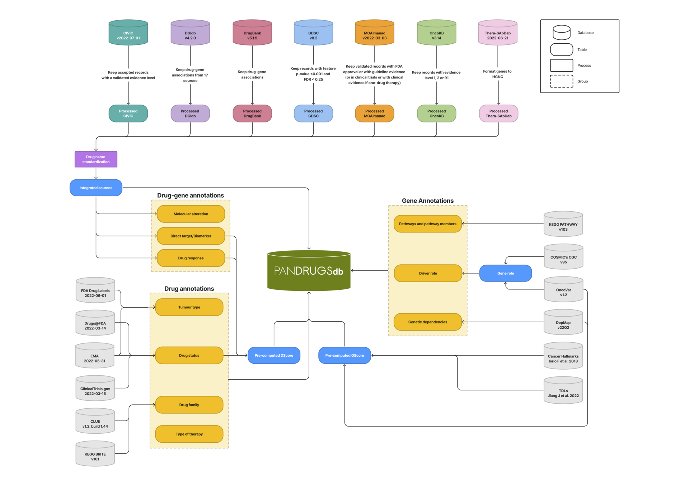

## PanDrugs Sources
PanDrugs database (PanDrugsdb) integrates 74,087 drug-gene associations from 24 primary sources. In addition, PanDrugsdb relies on other databases to standardize drug and gene names and retrieve annotations to compute the DScore and GScore.

| Source             | Version/Access Date\*/DOI    | License                     | Retrieved Information                                           |
| ------------------ | ---------------------------- | --------------------------- | --------------------------------------------------------------- |
| CIViC              | v2022-07-01                  | CC0 1.0                     | Drug-gene associations; Drug-gene annotations                   |
| DGIdb              | v4.2.0                       | MIT                         | Drug-gene associations                                          |
| DrugBank           | v5.1.9                       | CC BY-NC 4.0                | Drug-gene associations                                          |
| GDSC               | v8.2                         | CC BY-NC-ND 2.5             | Drug-gene associations; Drug-gene annotations                   |
| MOAlmanac          | v2022-03-03                  | GPLv2                       | Drug-gene associations; Drug-gene annotations                   |
| OncoKB             | v3.14                        | Free for academic use       | Drug-gene associations; Drug-gene annotations; Gene annotations |
| Thera-SAbDab       | 2022-06-21                   | CC BY 4.0                   | Drug-gene associations                                          |
| PubChem            | 2022-11-29                   | Free                        | Drug standardisation                                            |
| HGNC               | v2022-10-01                  | CC0 1.0                     | Gene standardisation                                            |
| ClinicalTrials.gov | 2022-03-15                   | Free                        | Drug annotations                                                |
| CLUE               | v1.2; build 1.44             | CC BY 4.0                   | Drug annotations                                                |
| Drugs@FDA          | 2022-03-14                   | Free                        | Drug annotations                                                |
| EMA                | 2022-05-31                   | Free                        | Drug annotations                                                |
| FDA Drug Labels    | 2022-06-01                   | CC0 1.0                     | Drug annotations                                                |
| KEGG BRITE         | v101                         | Free for academic use       | Drug annotations                                                |
| COSMIC's CGC       | v95                          | Free for non-commercial use | Gene annotations                                                |
| DepMap             | v22Q2                        | CC BY 4.0                   | Gene annotations; GScore calculation                            |
| KEGG PATHWAY       | v103                         | Free for academic use       | Gene annotations; Variant annotations                           |
| OncoVar            | v1.2                         | Free for non-commercial use | Gene annotations; GScore calculation                            |
| Cancer Hallmarks   | 10.1038/s41598-018-25076-6   | CC BY 4.0                   | GScore calculation                                              |
| TDLs               | 10.1016/j.celrep.2022.110400 | CC BY-NC-ND 4.0             | GScore calculation                                              |
| ClinVar            | v2022-05                     | Free                        | Variant annotations                                             |
| COSMIC             | v96                          | Free for non-commercial use | Variant annotations                                             |
| Domains            | 10.1371/journal.pcbi.1004147 | CC BY 4.0                   | Variant annotations                                             |
| InterPro           | v88.0                        | CC0 1.0                     | Variant annotations                                             |
| Pfam               | v35.0                        | CC0 1.0                     | Variant annotations                                             |
| UniProt            | v2022_01                     | CC BY 4.0                   | Variant annotations                                             |
| VEP                | v109.3                       | Apache-2.0                  | Variant annotations                                             |
| PharmCAT           | v2.1.2                       | MPL 2.0                     | Pharmacogenomics recommendations                                |

\* Dates are displayed in ISO 8601 standard format: YYYY-MM-DD.
